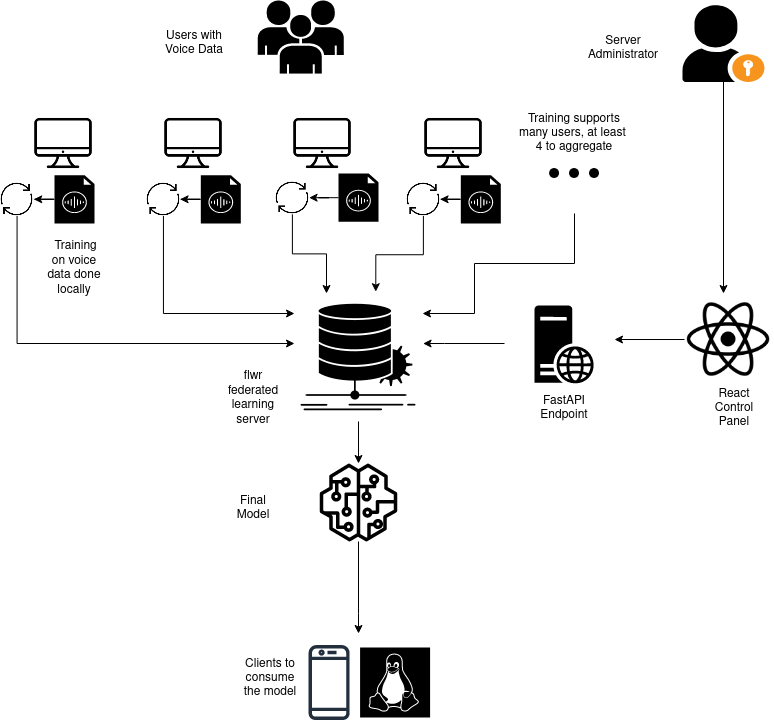

# Federated Learning for Training Voice Models and Improving Computer Accessibility 

This repository is a monorepo for all code and written work for my Princeton senior thesis in Computer Science. The associated final thesis paper is titled `New Opportunities with Voice Controlled Accessibility Software: Federated Machine Learning and Linux Mobile Devices` and was written under the advising of [Professor Kyle Jamieson](https://www.cs.princeton.edu/~kylej/). The final pdf can be read [in this repo](https://github.com/C-Loftus/Princeton-Thesis/blob/master/written_final_report.pdf) with the name `written_final_report.pdf`

## Background

The goal of my project is to develop a system for training machine learning models on sensitive medical data without actually needing to have the data directly. Federated learning allows this to be done by training on remote client devices. Thus, the models can be shared by aggregating the weights back to the central server, yet the original data has not been sent off device. This is important, as disabled users often have lots of computer interaction data from applications like voice-dictation, yet in typical machine learning systems this is sensitive data that is a liability to collect in a centralized manner. 
Until now, federated learning has largely been an technique used for industrial IoT. My paper shows how we can bring this technique to real world grassroots software communities and privately build practical new speciality ML-models while engaging users of all technical abilities to share their data. 

In addition to the technical aspect of this project, I incorporate my background in HCI and UX design to make web application UIs for machine learning software that are intuitive and accessible. A key challenge in federated learning is communicating with non-technical users who want to retain data autonomy, yet may not understand what is happening on their device during the federated learning process.

I use Pytorch and Flower (flwr) to implement a federated learning pipeline for the `Speech Commands` dataset. Individual clients download this Python code on their own device in order to train the model and share the model weights after training. I use React and Fast API to create a full stack web application to connect to clients. This is intended to be easy to set up for new server administrators that wish to support grassroots disability accessibility organizations.

I also support training on the audio data output from [Talon Voice](https://talonvoice.com/), a popular program for voice based computer accessibility. This allows users to take advantage of the accessibility programs they are already using to build new speciality voice models. The resulting model based on the `M5` architecture achieves impressive performance, even on this novel data source.

The models that result from my federated learning training software can be deployed on innovative new platforms like Linux mobile phones, a research interest in this paper. This platform is new, grassroots, and needs new accessibility solutions like specialty voice models.

## Codebase Walkthrough

This codebase is set up as a monorepo. The folder titled `doc` holds all documentation including the code used to generate this thesis from its markdown source. `server` holds the code for the central federated learning server and all code for aggregating weights or controlling the system from its web API. `client` holds all the code that a user needs in order to do local training and interact with the server. `frontend` holds the React frontend for the central federated learning server. Finally, `numen-modifications` holds any code related to linux mobile devices, scripts to interact with such devices through voice, or modifications to existing accessibility software.

My software created a full ecosystem for training and deploying voice models via federated learning and can be visualized in the following diagram: 

To build and replicate any software in this repository, there is either a `makefile`, `package.json` , or `pyproject.toml` file in each directory. A `.pythonversion` file specifies the proper version of Python to use (Python 3.8.14) and it is recommended to use `pyenv` to control Python versions to match and avoid any version errors. All testing was done on Ubuntu 22.04 but should work cross platform with few modifications.

All citations for this project can be found at `./doc/citations.bib`
