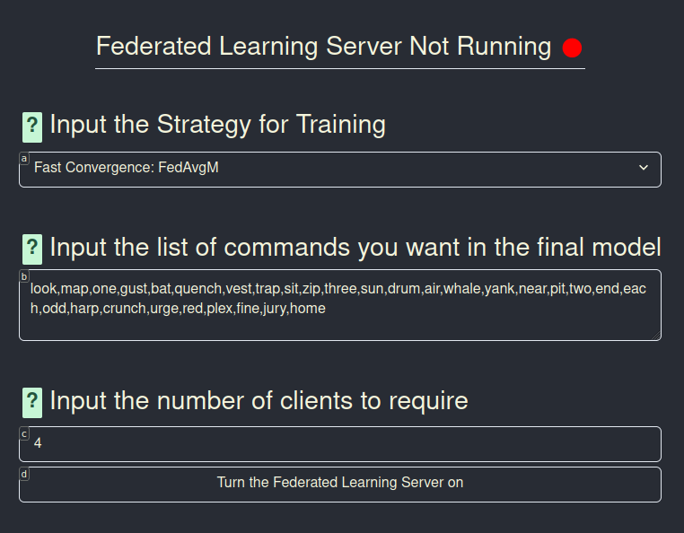

---
# try also 'default' to start simple
theme: seriph
# random image from a curated Unsplash collection by Anthony
# like them? see https://unsplash.com/collections/94734566/slidev
background: https://source.unsplash.com/collection/94734566/1920x1080
# apply any windi css classes to the current slide
class: "text-center"
# https://sli.dev/custom/highlighters.html
highlighter: shiki
# show line numbers in code blocks
lineNumbers: false
# some information about the slides, markdown enabled
drawings:
  persist: false
# page transition
transition: slide-left
use: UnoCSS
---

## New Opportunities with Voice Controlled Accessibility Software: Federated Learning and Linux Mobile Devices

### By Colton Loftus

---

# Introduction

For users with disabilities, new accessibility software with machine learning components has revolutionized computer accessibility.

Despite this new potential, there are difficulties:

- training new models
- sharing data
- preserving user privacy throughout the training process

This is since:

- Disability software is often community driven
- Healthcare data is often particularly sensitive

---

# The Solution: Federated Learning

Federated Learning is a machine learning technique that:

- Allows users to train locally on their own local data
- And then aggregates all weights together

Federated Learning is unique in that:

- No centralized entity sees user data
- We can use it to train existing model architectures

---

# Integration With Voice Controlled Accessibility Software

In this project I was specifically focused on hands free voice control software. This type of software allows

- Voice based computer input
  - Users thus don't need to use a keyboard or mouse
- Scripting and automating control of
  - Windows Control
  - Key Presses
  - Shell or Python Scripts

---

# My Project

The goals of my project were to

- Use Federated Learning to create an ecosystem for training new voice models
- Create voice model infrastructure for new platforms that don't have accessibility software
  - Linux mobile devices were of particular interest to me
- Make it easy to understand and accessible for all
- Integrate it with existing accessibility software

These goals are a challenge given the fact that

- Historically federated learning has been abstracted away from users
  - Apple uses it on phones, but does not tell users when it is occurring
- It is thus both a technical and design challenge to bring this technology to new audiences
  - We need to reimagine how we think about user data
  - There is great potential for social benefit if we can use federated learning for new healthcare technology

---

# Background: Talon

Talon is a popular voice controlled accessibility software tool. Although it is a great option, there are two downsides

- It is not open source
- It does not currently support mobile devices or ARM architectures in general

Despite this, it is a useful starting point for new models given the fact that

- It can automatically record and label user dictations while using the software

  - In thus it is easy for users to generate new and personalized datasets

These datasets can be used for federated learning training, and have the potential to be particularly useful for community driven ML tasks

---

# Implementation

For my software project I used:

- The federated learning library `flwr`
- React for my frontend
- FastAPI for controlling the federated learning process

---

# Evaluation

---

# Conclusion
