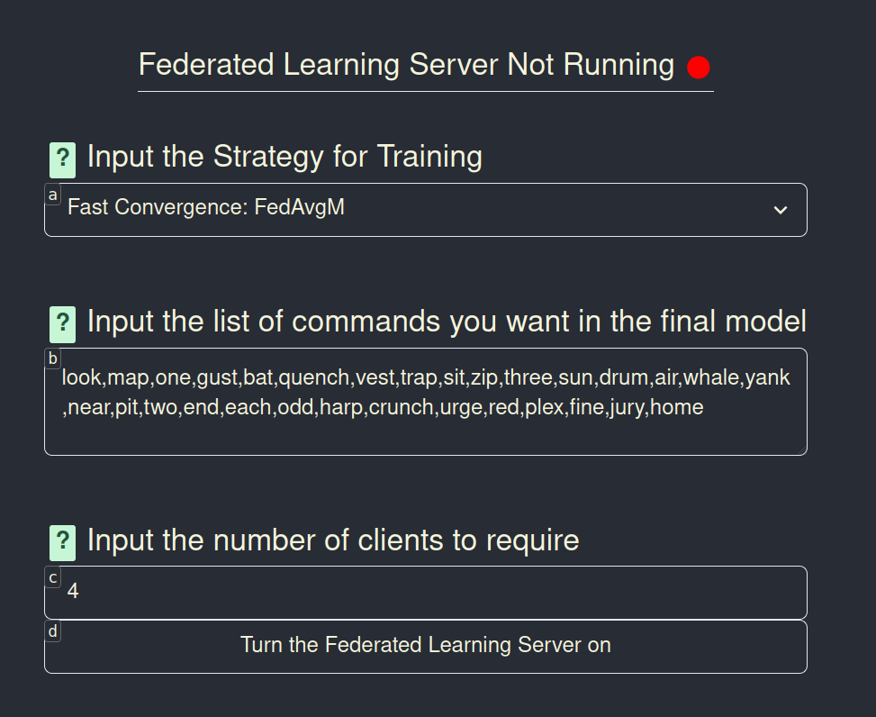
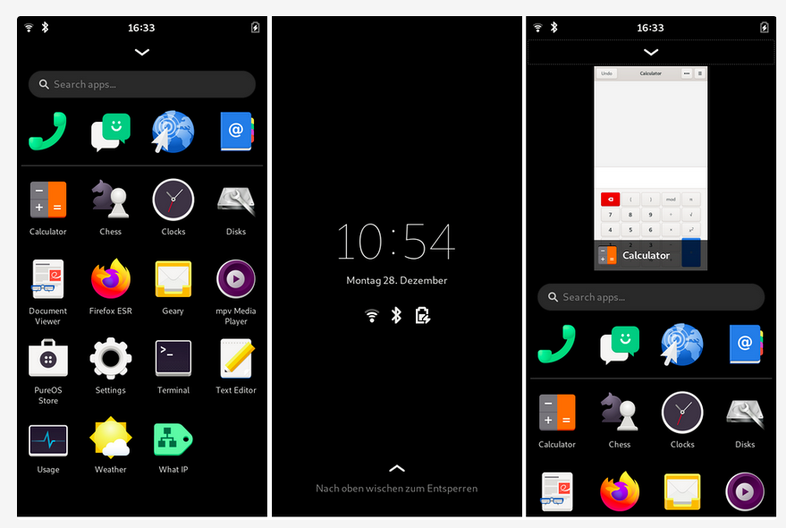
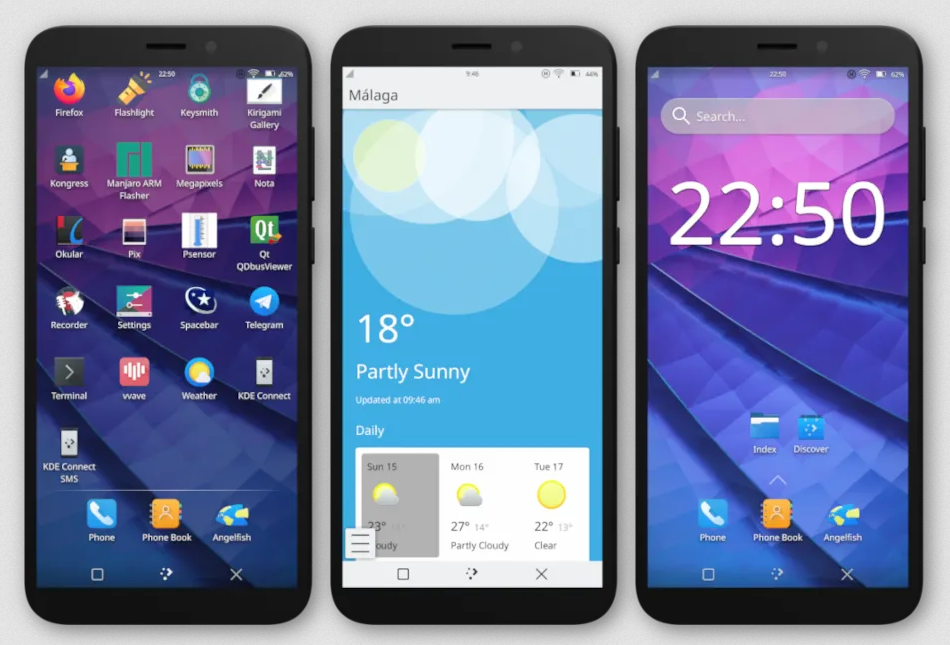
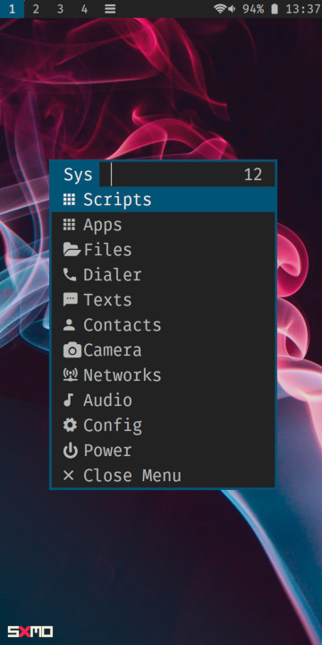
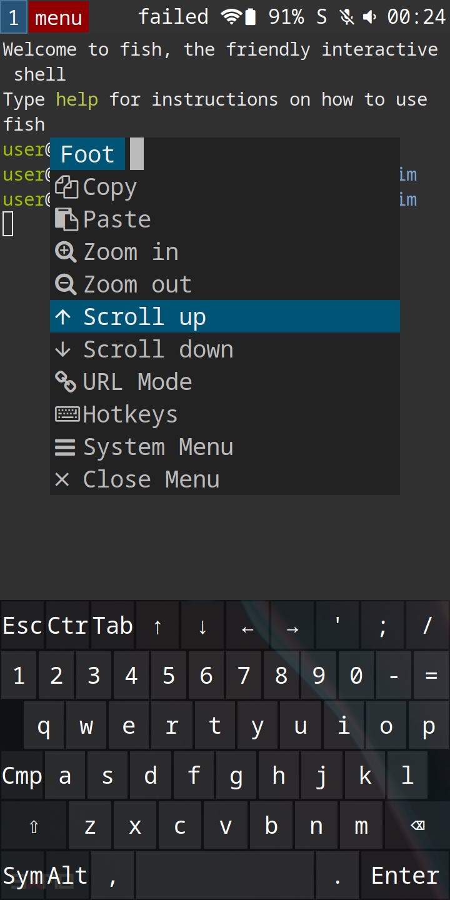

# Abstract

For individuals with disabilities, machine learning provides a powerful way to create more useful accessibility software. Voice recognition software is a particularly useful example that has allowed many to interact with their computers hands free.

However, many models related to specialty tasks suffer from a lack of data, well trained models, or an ecosystem through which to share them. Machine learning tasks for accessibility software often lack corporate incentives and thus depend upon community-led, manual solutions that potentially compromise privacy.

In my paper, I describe a novel way to apply Federated Learning for voice-based accessibility software. This solution using federated learning allows models to be trained without exposing sensitive voice data to a central server. It seeks to reduce the complexity of the federated learning process for end users and allows users to use their data generated from existing accessibility software. This data can be used to build the backend for new voice control software on mobile devices. Throughout this paper,I describe the technical implementation of this solution and the user experience goals that informed my design.

Finally in the last section of the paper, I discuss the current landscape of Linux mobile devices and and how we can more effectively bring voice control to this platform. I argue that the data sovereignty goals of Linux Mobile devices align well with those of federated learning. I discuss not only why federated learning is theoretically useful on this platform, but also the technical challenges building alongside other tools in this nascent ecosystem. At the end of the paper, I discuss the implications of this work for the future of accessibility software.

# Introduction

In recent years, machine learning has created significant advances in patient care across the healthcare industry. Sophisticated machine learning applications have emerged for drug discovery, accessibility accommodations, patient monitoring services, and much more. [@10.1145/3167486.3167551] Advances in reinforcement-learning now allows for vital healthcare applications to be deployed even in novel environments.[@10.1145/3477600] New ways of optimizing and distributing training has allowed for models to be trained in restrictive environments with limited data sets [@10.1145/3427796.3433935].

Despite these algorithmic advances, the logistics of healthcare data continues to make it one of the most challenging data sources for machine learning. It is subject to particularly strict legal regulations and the stakes for user privacy are often much higher than other social data. For instance, in the case of automatic diagnostic software, even if the model performs well, steps must be taken to ensure patient privacy throughout the training process.

Thus, in general in order to do machine learning for health care in a traditional setting, data must be rigorously anonymized and stored in secure computing environments. While this is theoretically acceptable, in practice it often fails. This is usually the case for a few main reasons.

#### Trusting legacy systems

When patients trust hospitals with their data, they are often in turn trusting legacy computing environments. Some may also have understaffed or underfunded IT departments. Due to how complex and old many healthcare IT systems are, it is only a matter of time before something goes wrong. Thus, what often happens is what is known as "normal accident" in sociology [@GVK021392943]. Even a small human error can cause a massive loss of data. Thus, we shouldn't necessarily be surprised when such a breach occurs, given the incentive for hackers and chance for so much to go wrong with just one mistake.

#### Anonymity is often not truly anonymous

Many healthcare facilities will preemptively protect patient privacy by only storing anonymous data. That is, data that is decoupled from identifiable information like names, places of residency, or other public info. Yet despite this, is often difficult to preserve enough useful information while still having anonymity. Studies have shown how anonymizing patient data often falls short with regards to data privacy. Many techniques exist for reconstructing and de-anonymizing such datasets. [@langarizadeh2018effectiveness] While methods have improved, it is impossible in principle to have an assurance of total privacy when sending data to a centralized system.

#### Patients don't have data autonomy

In the US, patients are not expected to manage their own medical data. Most hospitals and small healthcare providers have their own medical databases and manage patient records with proprietary software. While this is fine from a business perspective, it can be cumbersome for those looking to export and manage their own data. This is especially true for those that want to share data with non-profits or community initiatives. While what exactly would constitute a "good" data autonomy model is still up for debate, the fundamental idea is that medical data should be easy to export, and use for machine learning for the benefit of the public.

Thus in summary, our key challenge for machine learning in healthcare is preserving data privacy and user autonomy as we continue to scale our datasets. In 2020, worldwide medical data collection was estimated to be in the realm of 25 exabytes.[@10.1145/3010089.3010143] We need privacy solutions that can scale to this level of data, while still leveraging new machine learning models.

## Federated Learning

Federated Learning is a machine learning paradigm that seeks to solve these issues. In traditional machine learning, clients are required to send their data to a centralized server and trust it will take the appropriate protections to anonymize it. However,in Federated Learning, all training is done on user devices. Then after training is finished, all that is transferred to the server are the model weights. The data itself stays on user devices.

Essentially what this means is that the server never sees the data, and thus, it is not subject to the same privacy concerns as traditional machine learning. This is a particularly useful paradigm for healthcare. It allows data autonomy without needing to compromise on the use of large-scale datasets. Users can share data with non-profits and community initiatives without having to worry about the security of their data. This is because the data never leaves the user's device.

Currently within industry, federated learning has been successful particularly with mobile computing like smartphones or IoT devices. Companies like Google and Apple have been able to leverage federated learning to train models on datasets like keyboard data that would be otherwise sensitive to train on. Datasets like these have allowed for useful predictive typing models that are personalized to the individual user. However, as of right now, federated learning is still an emerging research area and usually is abstracted away from end-users.

## accessibility Application

While there are many domains that will benefit from this paradigm of data sharing, one of the most promising and the focus of this paper is voice controlled accessibility software. This software allows users without the use of their hands to control their computer without typing or using the mouse. For this type of software, it often relies upon huge voice datasets. While these models have good performance in general use, users may want to fine-tune them for specific applications that would otherwise not be contained in a general-purpose dataset. For instance, Mozilla's Common Voice \footnote{\url{https://commonvoice.mozilla.org/en}} is a great data set for general voice recognition, but may not be enough to support user with a particular accent, speech impediment, job specific technical vocabulary.

accessibility applications often are supported through grassroots communities with economies of sharing. Within such social arrangements, there is often a compromise regarding either efficiency or privacy.

## HCI and Design Work

In addition to the technical, algorithmic side of federated learning, there are a series of new design challenges for accessibility engaging users of all backgrounds.
For those without full use of their hands, many types of software interaction can be difficult or annoying to navigate with voice controlled software. For instance, not all programs expose an accessibility tree or have good keyboard shortcuts. This is even the case for some popular applications like Adobe Acrobat\footnote{\url{https://acrobat.uservoice.com/forums/590923-acrobat-for-windows-and-mac/suggestions/39448096-acrobat-reader-for-mac-does-not-expose-an-accessib}} As result, a user may be forced to use the mouse or an eye tracker which is a less than ideal solution. As a result, I wanted to build all my user interfaces with a web ui. Internet browsers have much more accessibility tooling built in and are generally more accessible. For instance, tools like Rango\footnote{\url{https://github.com/david-tejada/rango/}} and Vimium \footnote{\url{https://vimium.github.io/}} allow the user to navigate the web with just voice, or just the keyboard, respectively. Thus by creating my user interface for the web, I can take advantage of these already existing tools for better accessibility.

In addition to the accessibility aspects of our design for federated learning paradigms, we will also need to ensure ease-of-use. Most users are not accustomed to dealing with data in a decentralized way. Even among tech enthusiasts,

# Background

Before discussing my work, it is useful to give an overview of the existing field of voice-controlled accessibility software, Federated Learning frameworks, and the design principles that inform them both. This context will help to better explain the overall architecture and the specific choices I made while developing my software. For context, I specifically wanted to create a federated learning solution that could help to address some of the existing issues in both federated software and voice-based accessibility software.

## Federated Learning

Before discussing voice-based accessibility software it is useful to describe the current general landscape of federated learning and federated software. This will allow us to see its shortcomings, and potential for innovation. When we discuss accessibility software, it will give us a better perspective on how to integrate the two.

Federated Learning, despite being such a new and promising field, is based upon a much simpler and older one: federation. Federation as a general concept in computing is a backbone to many of the essential software tools we use every day. Email and git are two great examples of fundamental software technologies that are built upon federation. Anyone can start their own email or git server, control their own mail inbox or code repositories respectively, and choose to communicate with other servers of the same type. Despite the fact that these technologies are built upon federation, in reality the majority of individuals depend upon highly centralized applications (Gmail and Github, being two examples, respectively). As a result, if we want federated learning to break this general trend within federated software, we need both incentives and intuitive tooling to support independent communities.

For examples of this, we can look to recent studies regarding the behavior of users in other federated networks such as Mastodon. Mastodon is an alternative social media platform that anyone can self-host and federate with other instances. This allows for decentralized data sharing and moderation- However, even though the software is designed for decentralization, users often congregate towards centralized servers. [@10.1145/3355369.3355572] After Elon Musk bought twitter and caused many users to seek alternative platforms, Mastodon saw a huge influx of new users. However, many of these users were confused regarding which instance to use, and how their data was being retained. \small\footnote{\url{{https://www.newyorker.com/culture/infinite-scroll/what-fleeing-twitter-users-will-and-wont-find-on-mastodon}}}

Thus even though Mastodon is a social network and not a machine learning toolkit, it is a good example of how users are not accustomed to dealing with federated systems and decentralized data. When implementing new forms of data sharing we need not only new technical solutions, but also new design strategies. After all, our goal is to share data in a way that is both efficient and democratic. Little will be accomplished at scale if only power users and hobby hackers participate.

With regards to federated learning specifically, often programmers completely abstract away the federation process. For instance, in the case of mobile phones, it is assumed that a beneficent central company will train models in the background, and the user can benefit without needing to understand the process. Many, even technical users, are not aware that their phone passively trains such models at nighttime.

Thus, many papers in federated learning follow suit and do not deal with the social or design aspects of the the technology. They are primarily focused with attributes like energy efficiency or fault tolerance [@10.1145/3554980] [@10.1145/3556557.3557952]. While these are undoubtedly important attributes, it is certainly not the entire story. Given the fact that so much of the internet's monetization model is based around data collection, changing the way data is shared at scale could have significant social and economic consequences.

As we design for the future, it is important not to abstract away the decentralized and community driven potential for federated learning. As a result, when designing new applications we should not only focus on the technical aspects, but also trying to make it intuitive for users of all abilities and organizations of all sizes. This is one of the key aspects missing in current federated learning literature: there is not a clear vision for how to apply it beyond large companies, explain federation as a concept, and get non-technical users involved.
We will need to overcome these challenges for Federated learning to go beyond just industry adoption and eventually see it come to fruition in non-profits, online groups, and community organizations.

## Accessibility Software

Now that we have the general background of federated software and federated learning more specifically, it is useful to survey the general landscape of voice based accessibility software. Unlike federated learning, lots of the cutting edge and most used accessibility software does not come from academic research. See for instance cursorless \footnote{\url{https://www.cursorless.org/}}}, a community driven solution for voice programming that is significantly more efficient than other hands free offerings.
To summarize, within voice controlled accessibility software, many of the design philosophies behind different programs can be grouped into two main categories. Namely, application specific or general purpose accessibility software

### Application-Specific Accessibility Software

Application-Specific solutions are the first main category of voice based accessibility tools. These are often the solutions people are most familiar with and are built specifically for one platform like a web browser or smartphone app. In this model, it is up to each program to implement its own accessibility tools. One example is the extension LipSurf. \footnote{\url{https://www.lipsurf.com/}} This extension allows users within Chrome to control their browser with just voice. It takes advantage of browser specific accessibility APIs and thus does not provide any control of other desktop applications. While this is a downside for some, it can also be a benefit for others. LipSurf is very easy to install and use, and it is very clear where the goals of the project begin and end. This software makes no pretences of trying to support other desktop applications. As a result the developer and community can focus entirely on web tools.

Voice assistants like Siri or Alexa, could also be said to fall in this category. These solutions are not primarily focused on customizability and are generally restricted to specific operating systems and platforms. However once again, despite their restrictions, these solutions are popular given the ease of use.

### General Purpose Accessibility Software

General purpose accessibility software is the other philosophy behind the design of voice based accessibility software. Under this design philosophy, the user runs one large voice control program that can interact with the entire desktop, not just one application. Such programs often support their own scripting language for custom behavior. While this software style has much more potential for general use, it is also harder to learn for new users. It is also a greater development burden you need to design around the entire desktop, and not just one application like the browser that is cross platform.

#### Dragon

The first and perhaps most well known example of this sort of accessibility software is Dragon.Dragon is a proprietary voice control program that has been around since the 1990s (and even earlier with early builds). It is heavily marketed towards enterprise and business customers and tends to be focused on providing functionality for industries like healthcare, legal services, law enforcement, and others that require lots of writing. While Dragon has innovated on many fronts over the years, it currently only supports Windows. Given its proprietary licensing, can be hard to extend and customize. As a result, many users of Dragon (especially those looking to perform specialized tasks like computer programming) have begun to adopt other tools.

#### Talon

One such other tool is Talon. \footnote{\url{https://talonvoice.com}} Talon is a voice control engine for which individuals can write scripts to customize its behavior. Upon downloading it, Talon provides little desktop functionality and is only a voice parser. However, there is a large community repository of Talon scripts called Knausj Talon. \footnote{\url{https://github.com/knausj85/knausj\_talon}} These can be imported and customized as desired.

Talon has a large user community with specific user scripts for doing nearly anything you would want on your desktop, anything from coding by voice to playing video games. These solutions are often more customizable and efficient given the fact that their designers are often also part of the Talon community as users.
One of the benefits of Talon is that you can enable the option 'Save Recordings.' This will create an annotated dataset of user recordings for every command. Thus it is very easy to generate a personalized dataset when using talon.

While both of these voice control solutions work well for many, each has a downside. Both Dragon-Naturally-Speaking and Talon (here referring to the voice parser,not the user scripts) are closed source. This may be a downside for privacy conscious individuals, even though many extensions are nonetheless open source and community developed. Dragon-Naturally-Speaking is also not free, and the cost may be a significant impediment to many users. Finally, Talon Voice and Dragon do not support mobile devices and lack a way of automatically sharing data in its ecosystem. In Talon, contributing data to use for future model training involves a manual process of sending recorded data to the developer.\footnote{\url{https://noise.talonvoice.com}}

As a result there arenumerous research opportunities in voice controlled accessibility software. Everything from developing new open source voice parsers for mobile devices, to new ways of sharing community customizations and data, all have great potential to dramatically help not only current users, but also future users on devices and architectures that have yet to be commonly adopted.

## Linux Mobile Devices

As we saw when describing the current landscape of hands-free accessibility software, a significant amount of the issues come from the fact that parts of the ecosystem are closed source and do not support mobile devices. Additionally, even though Talon can automatically produce a personalized and labeled dataset, there are not any devices or ecosystems which seek to take advantage of this.

As a result, for my research, I was specifically interested in targeting Linux smartphones.Linux smartphones are unique in the fact that they are mobile devices, but can also typically run any desktop Linux software, so long as a ARM-build exists. This greatly reduces the friction for users that seek to migrate between desktop and mobile devices. An addition to these technical benefits, the demographic of these new open source mobile initiatives are looking to gain data autonomy and participate in grassroots social computing initiatives. This makes them more likely to participate in federated learning technology (especially given the privacy preserving nature of the tech).

By building for a new ecosystem like Linux mobile devices,I wanted to not only solve an existing problem in the voice controlled accessibility ecosystem, but also anticipate future issues that wall come about due to a lack of accessibility support on new ARM mobile devices.

Finally, as previously stated, Linux mobile devices can more easily run existing Linux software than alternatives like Android or IOS. First of all, this will allow me to experiment with a wide variety of user interfaces on top of my model. For instance, I can
use and or adapt my previous research developing an open source voice parser for linux \footnote{\url{https://github.com/C-Loftus/Starling}}. This will allow me to lay the groundwork not only for new community based federated learning solutions,but also the interfaces and higher level accessibility software that will build on top of it .

# Approach to Architecture Design

As previously stated, my project goal was to create a full-stack federated learning system for voice controlled accessibility software. I wanted to create an ecosystem to show how federated learning could be applied to all levels of the accessibility software space. Additionally, in doing so I also wanted to investigate new design principles and the emerging platform of Linux smartphones.

When designing my architecture I was focused on both technical efficiency but also user accessibility. Namely for the latter, I wanted to design solutions that worked well for users who use only voice. I also wanted to consider accessibility from a intellectual standpoint. It is important that I designed the architecture in such a way that is not opaque and allows for community contribution. I want users of all backgrounds to be able to clearly trace the path their data takes throughout the machine learning process.

With this in mind, I split up the technical implementation of my project into five main parts.

- Machine Learning Architecture and Algorithms
- Webserver Backend
- Webserver Frontend
- GUI Client for participating in federated learning and converting talon data
- Packaging and Distribution

A visual description of each part can be seen in the diagram below.

$$
 \forall{talon\_data}_1^{|talon\_data| := N}
$$

```{.mermaid format=svg .mermaid loc=assets}
erDiagram
    TALON_DATA_1 ||--|| TRAINING_CLIENT_1: converts
    TALON_DATA_1 {
        origin client_1_desktop
    }
    TALON_DATA_2 ||--|| TRAINING_CLIENT_2: converts
    TALON_DATA_2 {
        origin client_2_desktop
    }
    TALON_DATA_N ||--|| TRAINING_CLIENT_N: converts
    TALON_DATA_N {
        origin client_N_desktop
    }
    TRAINING_CLIENT_1 ||--|| FLOWER_SERVER : federates_with
    TRAINING_CLIENT_1   {
        platform desktop
    }
    TRAINING_CLIENT_2 ||--|| FLOWER_SERVER: federates_with
    TRAINING_CLIENT_2 {
        platform desktop
    }
    TRAINING_CLIENT_N ||--|| FLOWER_SERVER: federates_with
    TRAINING_CLIENT_N {
        platform desktop
    }
    FLOWER_SERVER ||--|| SPEECH_COMMANDS_MODEL: creates
    SPEECH_COMMANDS_MODEL  ||--|| LINUX_ACCESSIBILITY_CLIENT : powers
    LINUX_ACCESSIBILITY_CLIENT {
        platform mobile
    }

    REACT_FRONTEND ||--|| FAST_API_ENDPOINT: interacts_with
    FAST_API_ENDPOINT ||--|| FLOWER_SERVER: controls

```

With regards to the technical goal of this architecture, it was intended to make it so both a server administrator ( the person that will eventually get the final trained model ) and existing Talon users can easily start a federated learning training process . They should be able to do this without needing to have any knowledge of coding. In addition to the user experience goals, the technical design is loosely coupled and is thus easier to build upon in the future. For instance, since the federated learning process can be controlled through a web API,users can develop their own clients or integrate their own ways of parsing Talon user data. My architecture provides a useful default client but is by no means required.

# Implementation

With this background in mind, I will now proceed to discuss the implementation of my software and the various challenges I overcame. As stated previously, I sought to create a minimum viable product for implementing a full federated learning ecosystem. Each part of this ecosystem has a decoupled architecture which will allow new innovations to add features to specific parts of the system without needing to change others.

## Codebase Walkthrough

All of the code base for this paper can be found at [https://github.com/C-Loftus/Princeton-Thesis/](https://github.com/C-Loftus/Princeton-Thesis/).This code base is set up as a monorepo. `doc` holds all documentation including the code used to generate this thesis from its markdown source. `server` holds the code for the central federated learning server and all code for aggregating weights or controlling the system from its web API. `client` holds all the code that a user needs in order to do local training and interact with the server. `frontend` holds the React frontend for the central federated learning server. Finally, `numen-modifications` holds any code related to linux mobile devices and scripts to interact with them through
voice, or modifications to existing software like `numen`.

To build and replicate any software in this repository, there is either a makefile, `package.json` , or `pyproject.toml` file in each directory. A `.pythonversion` file specifies the proper version of python to use (python 3.8.14) and it is recommended to use pyenv to control python versions to match and avoid any version errors.

## Federated Learning Implementation

The first and most essential part of my project was implementing the technical aspects of federated learning. These new machine learning aggregation strategies affected not only my decisions regarding modeling, but also principles of user experience design.

The first thing I had to do was make a decision regarding which federated learning library to use. Currently there are a few main options. There are options like `fedjax` [@fedjax2021], Pysyft[@DBLP:journals/corr/abs-1811-04017], and flwr[@beutel2020flower]. While a comprehensive comparison of all options would be beyond the scope of this paper, I chose to go with flwr. This library allows you to apply federation strategies to existing models in popular frameworks like PyTorch and Tensorflow. flwr thus allows you to focus more on modeling and abstracts away aspects of federated learning like networking client descri and error handling that are less relevant to this project.

With this decision in mind, I then had to choose a model upon which I would implement federated learning. I had a few main goals for this model given the fact that it would be used on lightweight Linux mobile devices.

- It must be a model capable of processing human speech in English
- It should be feasible to train without a GPU
- It does not need to have a large vocabulary size
- The model itself should be small and easy to run on a mobile device
- The model should be focused more on commands rather than dictating sentences

As a result, I decided to use the M5 model architecture.[@https://doi.org/10.48550/arxiv.1610.00087]
This architecture is designed for making inferences on raw wave form data with minimal processing. Compared to larger conformer or wav2letter models, M5 requires less code and disk space to run. As a result it also makes it easier to deploy to mobile devices that may have limited disk space or nontraditional package management.

With regards the technical aspects of this model, it takes advantage of advances in convolutional neural networks while still making it relatively resource efficient to train and process inferences. For instance the paper says how "By applying batch normalization, residual learning, and a careful design of down-sampling layers, we overcome the difficulties in training very deep models while keeping the computation cost low."In the paper they use the UrbanSound8k dataset which contains 10 environmental sounds that the model is trained to distinguish. While this dataset is different from the speech commands used for voice controlled accessibility software, it is a good baseline metric for determining the models performance on classifying discrete noises in a noisy environment: also an essential property for accessibility software.

### Client Implementation

After implementing the model in Pytorch code, it then became time to integrate it with flwr and federated learning. In flwr, it is up to the user to implement 4 main functions on the model.

```
class FlowerClient(fl.client.NumPyClient):

    def get_parameters(self, config):

    def set_parameters(self, parameters):

    def fit(self, parameters, config):

    def evaluate(self, parameters, config):
```

As previously stated, in federated learning, all training happens on device and then the model parameters are exported to a central server where they are aggregated in some way, so as to preserve privacy but also reap the benefits from a large base of training data. As a result it is up to the client to define how they will fit the model, and export parameters to the central server. This implementation can be found in [client/training.py](../client/training.py). With regards to the details of the implementation, I use negative log likelihood as my loss function and batch processing to reduce the load of system resources. I use the former given the fact I am doing multi class classification over audio data and want a probability distribution that sums to one. With regards to batch processing, I wanted to incorporate accessibility in an unconventional way. While we often think about accessibility as a physical property, it can also be a technical one back can limit users with lower end hardware from participating in software communities. Simpler models and batch processing make it so we can engage with the largest possible audience. While I do not assume people will be training their models on Linux mobile devices, my hope was that strategies like these can open up such a possibility in the future.

### Client Training Data

Now that we have defined the overview of my model architecture I will described the training data that can be used to generate the model. Given the fact that the M5 model is designed for short commands and not full sentences, it is find useful data or generate new data sets from existing ones. One such example is the `SpeechCommands` dataset. I was able to take advantage of existing research using this combination of the dataset and M5 \footnote{\url{https://github.com/pytorch/tutorials/blob/master/intermediate_source/speech_command_classification_with_torchaudio_tutorial.py}}. This dataset is a series of roughly thirty different common words that could be used as commands. ( For instance common names, numbers ,and directions). This is a useful data set for testing the model architecture and providing a good baseline for federated learning, before new user data is factored in.

The next source of user data is from user generated datasets. As spoken previously, [talon](#talon) is one of the most commonly used community driven voice control solutions.
Talon commands use natural language to control the desktop in an intuitive way and automating many tasks that would otherwise be very tedious. Talon can also send keyboard inputs or dictate full paragraphs. Some example Talon commands\footnote{ To clarify, when I say Talon commands I'm referring to the commands in the default community distribution of talon scripts called "Knausj"}, for context include:

- `focus firefox`
- `new bookmark`
  - ( examples of custom, application specific commands)
- `press enter`
- `press control shift pit`
  - ( examples of keypress commands)
- `Talon can also dictate long sentences like this and thus is great for many difference contexts`
  - (example of a dictated sentence)

While saying these sorts of commands,Talon allows users to automatically generate labeled recordings as they use the software. This is usually used for debugging purposes, but it can also be used to generate a dataset for training future models.

By default Talon outputs its data in a `.flac` format and includes every single parsed audio statement. As a result it includes audio of variable lengths. To convert the audio into a format that can be used for training, I wrote a script located at [client/scripts/parse_talon.py](../client/scripts/parse_talon.py). Once the user data is filtered through this script the user will have a large dataset of speech commands that can be used with the M5 model above. To ensure that only useful commands are making it into the training set, the central server can define a schema of commands. If we did not have this safeguard, then some users could mistakenly train with infrequent or unusual command names. ( This is since Talon is so customizable and allows users to change command names or command frequencies very easily). A central federated learning server administrator can decide which command names the community should train with. By default the commands are the most common ones said in Talon, namely the names of letters ( according to a phonetic alphabet), numbers, and common key names (enter,home, etcetera)

## `flwr` Central Webserver

Now that we have described the model and the data, it is important to clarify how the `flwr` webserver is setup in my project. To begin the entire federated learning process, a server administrator will launch the `flwr` webserver. This will open a port for clients to connect to. It is up to the clients to use their data and train the models locally. However once an epoch has completed, the parameters will be sent to the central webserver and an aggregation function will be ran.

### Federated Learning Aggregation Strategies

In federated learning, the `flwr` server needs to make a decision regarding how to aggregate the weights from the different clients. Different aggregation strategies can be used to provide better properties for specialty tasks, or make up for technical limitations in the client system (power, network connection, processing power, etc).

When deciding to use a strategy, it is important to consider how many of the following properties hold: [@https://doi.org/10.48550/arxiv.1602.05629]

- Non-IID: Any particular user's local data set will not necessarily be representative of the population distribution
- Unbalanced: The number of samples per user is not necessarily the same
- Massively Distributed: The number of users is very large
- Heterogeneous: The users' devices are different (e.g. different hardware, different operating systems, different software versions, etc.)
- Limited communication: The users' devices are not necessarily connected to the internet all the time, or have limited bandwidth

The most well known federated learning algorithm is FedAvg, this appeared in the same paper where the term "Federated Learning" was coined.[@https://doi.org/10.48550/arxiv.1602.05629] This algorithm works by randomly sampling from the users and averaging their update weights. However, this algorithm has some limitations. If we have particularly unbalanced data the algorithm may not aggregate between clients well. For this reason, the algorithm, Federated Average with momentum (FedAvgM), was proposed. This strategy helps to eliminate the unbalanced data problem by using a momentum term to help the algorithm converge to a better solution. [@https://doi.org/10.48550/arxiv.1909.06335] This algorithm uses a gradient history to dampen oscillations during training. As a result, this algorithm also has the favorable property of being able to generally train more quickly than FedAvg.

While approaching training from perspective of data. distributions is one way to approach the tradeoff, we can also use strategies that try to limit network communication between the client and the server. One such strategy is known as QFedAvg. This strategy uses a quantization technique to reduce the amount of data that needs to be sent between the client and the server. [@https://doi.org/10.48550/arxiv.1602.05629] This strategy is particularly useful when the clients have limited network connectivity. If network speed is not the issue but rather interruptions in the connection, we can use FaultTolerantFedAvg.

Finally, we can also modify and use adaptive optimization methods from traditionally non-federated algorithms. We can use federated versions of adaptive optimizers, including Adagrad, Adam, and Yogi to make our systems easier to tune and gain more favorable convergence behavior. [@https://doi.org/10.48550/arxiv.2003.00295] The downside is that FedOpt, FedAdaGrad, FedAdam, FedYogi all require "initial_parameters to be set" in `flwr`. This means that they are best used to improve the performance of an existing model, not necessarily be the backbone of training a model through federation from the ground up.

`flwr` supports all of these aggregation functions and as a result I have built all these algorithms into my own program. However, it is important to discuss which should be the default strategy given the general properties of this machine learning task. As we stated previously this task for voice recognition with talon data has:

- a relatively small amount of users but a relatively large amount of data from each
- no existing publicly available models to train on top of
- a shared subset of labels coming from a central schema on the server at training time
  - however between different users, there is not necessarily a common distribution for each word on this subset
  - This is since the dataset is being generated through everyday usage of talon, not specifically to try and make a dataset
- relatively stable internet connections ( at least compared to federated learning on IoT devices)

As a result from these properties we can see that training with talon is actually a much different task than some of the classic federated learning challenges discussed above [@https://doi.org/10.48550/arxiv.1602.05629] For Talon users, the main challenge is trying to converge relatively quickly with a relatively small amount of data (since we are operating at the scale of individuals in a community, not sets of patients in entire hospitals or similar scales). As a result I chose to have FedAvgM as the default aggregation function. This algorithm helps to reduce the impact of uneven data distribution you would see among user datasets. It does not focus as much on network connectivity like QFedAvg since we can assume that many Talon users have relatively stable internet connections ( given the user demographic of talon being fairly technical due to its customizable nature). Finally I did not choose any of adaptive optimization methods since we currently do not have any pretrained weights to use as a baseline.

In summary, talon data is not only an interesting data source that is easy to generate Over a long period of time, it also challenges many of our assumptions about federated learning. Namely that the bottleneck is in power , network communication, or convergence time. We saw much the opposite, that federated learning with talon data is more constrained on the size of the datasets and as we will discuss later, also the social aspects of getting community members involved.

## Additional Backend Functionality

While `flwr` is an excellent technical library, similar to other federated learning research mentioned in [background](#background), it provides little functionality for end-user interaction. By default, the server blocks the main thread and isn't intended to be interacted with while training. In order to get information like the amount of clients, whether training is in process, and networking information, it is necessary to extend the behavior of the default code.

Thus,to extend this behavior, I decided to create another web application as a wrapper over `flwr`. This web application is used to create an API for useful metadata and controlling the training process. For my backend I used FastAPI. FastAPI allows for the creation of web apis in Python.

With regards to technical features, the wrapper over `flwr` is relatively simple. However despite this, there are once again interesting social implications with such design decisions. At stated previously, federated learning has often been applied to edge and mobile devices, and is totally abstracted away. Thus it makes sense that by default `flwr` does not provide all of these controls that i added in my API. Thus, there is an important lesson to take away from this . For us to achieve our accessibility goals, it is not always about user interfaces, but sometimes is about more foundational aspects of a code base. We ought to ask ourselves, why is certain data being exposed or hidden from the user. What do these decisions of visibility reveal about the the underlying premises of a technology? To achieve success with federated learning in a communal environment, we need to make it easy for developers and community members to get the data they need, not just server administrators controlling the backend.

## Webserver and Client Frontends

Now that we have described the entire backend and machine learning implementation, it is useful to describe the front ends that control it. Once again, when creating different front end technologies, there was not only the question of feature richness and visual design,

The front end for this project was implemented using React




## Packaging and Distribution

As stated previously the goal of this project is not only to implement a full stack federated learning application from a technical standpoint, but also do it in such a way that is intuitive and user friendly. One of the core challenges confederated learning can also be viewed from a DevOps perspective: namely, packaging and distributing machine learning code to users with many different environments.

One of the advantages of building for Linux devices is that there are already multiple options for packaging and software distribution. I had a few main goals when distributing my software. While machine learning dependencies are often very large,

## Qualitative Design Choices and Accessibility

As stated in the [introduction](#introduction), one of the main goals of this project was to implement federated learning in a way that would be accessible for users of all backgrounds. It wasn't enough to simply make federated learning more transparent and user friendly. It also had to be done in a way that supported users that rely upon assistive technology.

As such, there were a series of essential principles that helped to guide and inform my design decisions. These principles are important not only in the context of this project but also for any software that seeks to be more accessible.

### Design Around Discrete Instead of Continuous Inputs

Whenever you are looking to control an application interface, you should look to use tools that have a declarative way of separating different content into components. The clearest example of this difference is seen in keyboard driven interaction verses mouse driven interaction. If you design software around the keyboard, it is also easy to control with voice. For instance, a keyboard shortcut can be replicated by using a program like Talon and telling it a command like "press control cap" (cap being the name for the letter 'c' in the Talon phonetic alphabet). However, this cannot be done in the same way with mouse driven interaction. If the user is required to click a button like a GUI program with a toolkit like QT or GTK, this is much more difficult to do with voice. Instead of a clearly defined shortcut, the user has to navigate the mouse to a specific position. The alternative would be looking into the application code and trying to script it. However this is completely contrary to user center design. It forces the user to look into behavior that is deliberately abstracted away to begin with.

### Design around Web Interfaces

While many developers decry the loss in efficiency caused by the rewriting application clients for the web instead of directly on the desktop, web interfaces in truth provide a variety of important accessibility functionality. As mentioned previously in the paper, many programs for the desktop do not expose an accessibility tree. If they do, it can often be a second thought for large teams, or a burden for small ones. On the contrary, web interfaces already provide a series of useful properties. As we mentioned in the previous section, web interfaces are split up into a series of discrete components (HTML blocks) beneath their styling. This makes it significantly easier to navigate with just voice. Rango \footnote{\url{https://github.com/david-tejada/rango}} is a great example of a tool that builds upon Talon and takes advantage of web interfaces. It puts a small "hat" of letters over each clickable element and allows a user to navigate simply by seeing the name of the element. As such, it natively works with nearly all websites ( disregarding ones that purposefully deviate from accessibility guidelines).

Hence for this reason I chose to build the server frontend in React and used PysimpleGUIWeb (instead of PySimpleGUI desktop). I don't have to do extra work to make my interfaces navigable by voice. Additionally, web browsers are already well supported by other forms of accessibility software. For instance, for those who use screen readers it is often preferred to be able to navigate a website rather than desktop GUIs. ( For the same reasons as above: not all programs keep these sorts of users in mind when designing) Finally, accessible design is made even easier on the web due to the fact that UI libraries like Chakra UI for React abstract much of the technical details of accessibility away from the programmer. For instance, they don't need to worry as much about HTML style conventions since it will be compiled down from a higher level React component.

### Build Upon User Interfaces,Don't Create New Ones

With accessibility software, it is generally understood that the goal is to make computers usable for people of all backgrounds. However, to achieve this goal, some may go beyond and try to create software specifically for voice control. For instance, some users have created desktop environments \footnote{\url{https://git.sr.ht/~geb/tiles}} specifically for voice. While this is laudable work, we should also recognize that we can build alongside existing mainstream software. This also makes it easier for users to transition in and out of their accessibility software setups ( in case of varying health). Thus, the ideal accessibility software ecosystem is symbiotic: software should work well without voice, even better with it, and be easily decoupled if needed. This is yet another reason why building around the web with its robust ecosystem of extensions and developer tools is yet another good idea for accessibility software.

# Bringing Accessibility Software to Linux Mobile Devices

Up until this point,we have created a system for creating datasets from Talon, training models with federated learning, and controlling it all through an intuitive web interface. With this in mind it is now useful to begin a discussion regarding how voice accessibility software will integrate with the current landscape of Linux mobile software. As stated previously, in this project I was focused on Linux mobile devices. This is since Android and iOS already have voice control options. Additionally, these systems tend to be more locked down with less flexibility for user tinkering.

## User Interface Choices

Just like on the Linux desktop, there are many options for mobile Linux phones each with their own design philosophies, technical tools, and target demographics. As stated previously, Linux mobile phones are a relatively recent phenomenon and have nowhere near as much support as the desktop Linux community. As a result much of the development is entirely grassroots and community driven with very little corporate funding or academic sponsorship. As a result, I believe that this is even more of a reason why it is so important to develop accessibility tools as soon as possible for the platform. Without these tools, entire demographics of users will be left out from this new software revolution. While this may seem like an overstatement, there are many reasons why Linux smartphones are particularly unique and worth caring about.

### Open and Private by Default

Linux smartphones are unique in the fact that they are designed to be open source at all levels.
While Android can be rooted and many custom roms can be installed on popular phones like the Google Pixel, none of this process is encouraged by the manufacturer. In this case, there is a clear divide between the hardware and software developers. While many people point out how android is open source, the size and monolithic nature of the code base makes it prohibitively difficult for average users to make contributions. For instance in order to make any sort of fundamental changes, it requires the user to download the entire one hundred gigabyte codebase and have roughly sixteen gigabytes of ram to recompile from source. Finally most hardware manufacturers patch their own close sore software on top of stock android, effectively undermining any sort of claims of user freedom.

With Linux smartphones, the user has essentially any freedom they would have on the desktop. Specific hardware manufacturers have also arisen that align themselves with the same goals as the software community. One such company is Pine64. Their Linux smartphone called the PinePhone was used for all Linux mobile testing and development for this project. this device is relatively ubiquitous for the Linux mobile software community and as a result it supports nearly all software in the ecosystem( This is not always a given given the wide variety of mobile specific hardware like cameras, modems, and environment sensors)

### Multiple Options for User Interfaces

Given the fact that lots of existing desktop software can be ported to mobile, there are both many options for both the OS itself, as well as the user interfaces. For context, these are analogous to what would be the desktop environments on a desktop Linux computer. I choose not to use the term desktop environment when speaking about mobile devices, just for clarity. While discussing the many intricacies of the different mobile operating systems is not of particular relevance to this paper, the different user interface options on the other hand have significant relevance to user experience and the design of voice controlled accessibility software.

Just as we did previously when discussing different types of voice controlled accessibility software, it is helpful to provide a brief overview of the state of mobile Linux user interfaces. There are three main options: Phosh,Plasma Mobile and SXMO. By enumerating their strengths and weaknesses it will help to contextualize the design of my voice control client.

#### Phosh & Plasma Mobile

Phosh It's a mobile Linux user interface based upon Gnome.Given the fact that many Gnome applications already support devices with small screen resolutions, many apps transfer over well with few modifications necessary. Generally speaking, the user experience seeks to mimic earlier versions of android. There's a app drawer with app logos, menus that are accessed from swiping down at the top of the screen, and a gallery of running applications. As such it is relatively user friendly and has already shipped on some commercial smartphones like the Librem 5 from Purism. Given the fact that Linux smartphones are still in their infancy,Phosh has gained much support simply due to the fact that it is more stable and/or lighter weight than many other interface options.


The next main Linux user interface is Plasma Mobile. Plasma Mobile has a similar design philosophy to Phosh, except for the fact that it is based on KDE, not Gnome. Once again it borrows a significant amount of its design philosophy from android and iOS. Plasma mobile has a standard home screen of applications with GUI menus and homescreen widgets.



While much more could be said about both of these user interfaces, the fact is that they are largely seeking to mimic existing designed principles. They are primarily touch focused and have a familiar focus upon a homescreen with Gui applications. However, neither of these interfaces have had the time or money to develop in the same way as android or iOS. as a result, Linux accessibility on mobile is sorely lacking. as stated previously, talon and dragon do not run on these devices and given the fact they are totally centered around touch input, they are essentially unusable for people with accessibility issues. However come of this does not have to be the case. How can we rethink user interface design to design accessible systems, even in a constrained environment?

#### SXMO

SXMO, (Simple X Mobile), is the third major mobile Linux user interface. However, it takes a significantly different design approach regarding both the user experience and the underlying software that powers it.SXMO is designed to be minimalist in nature and closer to the unix philosophy of simple distinct minimal programs.SXMO is not built on either Gnome or KDE but rather a highly modified version of DWM .DWM is a dynamic tiling window manager Linux desktops. This means that it automatically fits new windows to a grid or workspace as they are spawned.Traditionally this software has been primarily used by Linux enthusiasts looking for a lightweight and hackable desktop. ( For instance, there is no config file. To make any custom changes you need to edit the source code itself.)

At first glance, this seems to be even worse in accessibility than both Plasma Mobile and Phosh. However this is not the case due to a series of modifications over DWM. SXMO, instead of prioritizing touch input, uses a series of context menus to navigate around the system. For instance, when you are in the terminal you can press the volume up key to launch a menu with the following options

<!-- <div style="display: flex;" markdown="1">

{width=50%}
{width=50%}

</div> -->

<div style="display: flex;">
{width=50%}
</div>

<div style="display: flex;">
{width=50%}
</div>

- Copy
- Paste
- Zoom In
- Zoom Out
- Scroll Up
- Scroll Down
- URL Mode
- Hotkeys
- System Menu
- Close Menu

The behavior of the different keys can be found at [https://git.sr.ht/~mil/sxmo-dmenu/tree/master/item/dmenu.c#L592](https://git.sr.ht/~mil/sxmo-dmenu/tree/master/item/dmenu.c#L592). We care about

https://cgit.freedesktop.org/xorg/proto/x11proto/tree/XF86keysym.h

```
#define XF86XK_AudioLowerVolume	0x1008FF11   /* Volume control down        */
#define XF86XK_AudioMute	0x1008FF12   /* Mute sound from the system */
#define XF86XK_AudioRaiseVolume	0x1008FF13   /* Volume control up          */
```

For context,SXMO was designed alongside many users using the pine phone. This device has relatively low end specifications and a touchscreen that is rather underwhelming. As a result SXMO decided to use the volume up,volume down, and power buttons as discrete navigation options. Instead of trying to mimic android and iOS it created its own mobile design philosophy. Namely, provide a way to launch menus with nested, configurable options. Then software developers can implement menu options for their application. Under the hood, it is simply controlling sets of shell scripts that the user can easily access.

As we discussed previously, voice controlled accessibility software works best with discrete, clear labels as well as building upon existing interfaces, not replacing them. SXMO does exactly this. For instance, when a menu shows up on the screen, a user has a distinct set of actions that they can perform. They can very clearly use a command like `five` to refer to the fifth element in the menu. This creates for not only a simple command to remember, but also one that is easier to train and later weight to run, compared to a general purpose voice recognition model.

Another key element of SXMO is the fact that it is meant to be hackable. This means that menu actions can easily be edited in distinct shell scripts and it is easy to extend the behavior even of relatively fundamental aspects of the user interface, such as the desktop itself.SSH is also well supported which makes the device feel like a small Linux desktop, more than a distinct mobile device. while this flexibility will require lots of development work to bring it to fruition, the fact of the matter is that SXMO has a fundamentally different way about thinking about mobile computing.

To summarize SXMO's design philosophy:

- make it hackable and transparent
- don't harshly distinguish between mobile and the desktop
- don't use unnecessarily complicated software
- try simple analog input options before complex touchscreen ones

All these properties make SXMO a particularly exciting platform for experimenting with the next generation of accessibility software and alternative HCI ideals. SXMO isn't trying to mimic iOS or android, and that is exactly what makes it special. SXMO Provides a lightweight and transparent way of controlling all the essentials of your phone, Yet at the same time being designed in such a way that can be extended ( in this case, with accessibility software)

Now that we have summarized the landscape of Linux mobile phones and explained the User interface properties that are desirable, I will explain the prices of actually bringing voice control to Linux mobile devices.

## Voice Assistants and their Challenges

When discussing accessibly software, we saw how one of the most important decisions is [knowing what sort of other non- accessibility software to pair it with](#build-upon-user-interfacesdont-create-new-ones).Thus,
it is not enough to simply have a good model, but we must also understand the sorts of tasks that should be controlled and what software will pair well with voice control. With this in mind, I will now discuss the current tools we have when designing for Linux mobile devices and what needs to be done in this ecosystem before bringing in federated learning systems.

Before I develop software that uses my federated learning models, I believe it is important to establish a series of other baseline functionalities: an API for a stream of non-blocking model inferences, variable vocabulary at runtime, and a simple programming language for writing user scripts. Given the fact that accessibility software is not useful if it is not practical, I found it most important to focus on these baseline practicality functions first.

As a result, I chose to build upon the voice accessibility software, numen.

## Numen

Numen is a simple general purpose voice control program that can run on low power devices like the pine phone or other Linux smartphones. It happens to be quite similar in design to my own open source Talon clone I made previously[https://github.com/C-Loftus/Starling](https://github.com/C-Loftus/Starling). Namely, it uses the speech toolkit Vosk and allows the the user to control the computer by writing concise shell scripts ( which are called from a config file listing all commands). However, Numen is focused on Linux mobile devices, whereas software like Talon, my previous work on Starling, and Dragon are not.

For context, Vosk is a speech toolkit\footnote{\url{https://alphacephei.com/vosk/}}. In addition to the speech to text model, it provides a streaming API, can change the vocabulary during runtime, and is optimized in size and performance for lightweight embedded devices. Vosk helps to solve one of the trickiest problems with voice control: namely when to stop listening to audio and return the inference from the model. As a user we take for granted the fact that voice assistants like Siri or Alexa know when we have stopped speaking. In accessibility software like Talon, this is even harder given the fact that users may chain commands together in quick succession. Thus for voice control to be practical,we should not use blocking or batch based inferences.As such this is why Vosk is particularly useful. It provides a continuous stream of inferences and will only return an inference when the probability has reached a user defined threshold.

With this context in mind, it makes sense why I want to build upon Numen first instead of building another tool from the ground up. When working with accessibility software it is extremely important to work with a central community that can support users in adapting to the software, and aggregate community scripts for voice control. This is what Talon has done on the desktop with the community repositories like [https://github.com/knausj85/knausj_talon](https://github.com/knausj85/knausj_talon)

While my model made from federated learning is not in the Vosk format, and is instead in the numpy .npz serialization format, in the future work can be done to transfer these weights between the two different formats. Given the fact that this paper is primarily focused on the training ecosystem, practical user experience, and HCI design of voice based accessibility software, I was content on using Vosk and Numen for the time being. In the future, work can be done regarding converting federated models into this Vosk format. However, I chose to prioritize the most impactful use of my time to contribute to the nascent Linux mobile accessibility ecosystem ( In in doing so hope to guide it with the principles I learned while using Talon).

## Numen's Design Principles

Despite the fact that Numen is a general purpose voice control program, it differs greatly from programs like Talon or Dragon. Numen does not have an associated scripting language, but rather can call existing scripts on the user's device. As a result, it requires a more technical understanding, yet at the same time is lighter weight and easier to run on a low specification device. It is important that we understand numen's design principles since it shows something about not just Numen but also the general ecosystem of Linux mobile devices. In order to bring new federated models and machine learning ecosystems to a new platform, we first need to understand the user goals and existing communities.

These are some examples of numen phrase scripts. On the left is a word and on the right is either a list of keys or the path to a shell command. In front of the word, there can also be words with the @ character. This character signifies a meta property that effects how the model parses the word. For instance reducing response time, or canceling a previous command that was said in the same phrase. In the phrasing of talon, the left would be a capture with some sort of capture modifier, and the right would be a command.

```
#  Press the control key
troll:mod ctrl
# Delete One Word to the Left
clear left:press ctrl+BackSpace
# Navigate to the window in the given direction
@rapidoff west:unstick press super+Left
# Transcribe a sentence
# For example, "scribe please type this".
@transcribe say:set fmt echo normal\
localpen printf %s\\n "$NUMEN_TRANSCRIPT" | /usr/libexec/numen/phrases/fmt "$fmt"
```

As you can see from the default commands, numen generally tends to be lower level and more imperative than declarative. There are some benefits to this. For instance, if a user already knows many keyboard shortcuts, they don't need to learn a list of new declarative commands ( as they can simply say the key names). This aligns with the ui principles we described previously, namely: [designing around discrete inputs](#design-around-discrete-instead-of-continuous-inputs) as well as [building upon existing interfaces](#build-upon-user-interfacesdont-create-new-ones).

Despite the fact that these are good principles, sometimes it does go too low level. Additionally, the program does not support some of the key features seen in other programs like talon. For instance, there is no notion of modes that separate commands based on a specific use case, or context based commands that only activate with certain programs focused. One example of such a mode that is seen in many voice control programs is sleep mode: namely where the model doesn't do anything until a certain wake command is heard.

https://sources.debian.org/src/sxmo-utils/1.12.0-6/configs/default_hooks/three_button_touchscreen/sxmo_hook_inputhandler.sh/

## My Additions to Numen

The first additions I made to the code base were convering

With all these additions now summarized, I believe Talon users and others interested in voice controlled accessibility software have a strong foundation to build upon.

# Evaluation

Given the fact that this project had both a technical machine learning implementation and a theory for its user experience design , I will be discussing the evaluation in two main parts: namely, the quantitative and qualitative aspects.

## Quantitative Evaluation

In this project, I built upon an existing M5 model architecture and the SpeechCommands dataset. These models and datasets have already had evaluation done on them. [@https://doi.org/10.48550/arxiv.1610.00087] For those interested in the more fundamental quantitative aspects of the model evaluation, that existing paper already answers many of those questions. Yet in addition to the fundamental model baseline, I also made a series of changes in the architecture and training process. I will first describe the changes in the architecture and how they impact model performance.

By default, implementations of the M5 model used `stride=16` and `n_channel=32.` In order to accommodate for the variable length of Talon audio data, I changed these numbers to stride=8 and `n_channel=64`. I halved the stride, and doubled the channels if Talon audio data is being used for training. Dividing the stride by 2 makes it so there is less pooling, and multiplying the channels by two will increase the number of filters learned by each convolutional layer.

`

```python
def __init__(self, n_input=1, n_output=35, stride=16, n_channel=32, useTalon=False):
  if useTalon:
      stride=8
      n_channel=64

  print(f"n_input: {n_input}, n_output: {n_output}, stride: {stride}, n_channel: {n_channel}")
  self.conv1 = nn.Conv1d(n_input, n_channel, kernel_size=80, stride=stride)
  self.bn1 = nn.BatchNorm1d(n_channel)
  self.pool1 = nn.MaxPool1d(4)
  self.conv2 = nn.Conv1d(n_channel, n_channel, kernel_size=3)
  self.bn2 = nn.BatchNorm1d(n_channel)
  self.pool2 = nn.MaxPool1d(4)
  self.conv3 = nn.Conv1d(n_channel, 2 * n_channel, kernel_size=3)
  self.bn3 = nn.BatchNorm1d(2 * n_channel)
  self.pool3 = nn.MaxPool1d(4)
  self.conv4 = nn.Conv1d(2 * n_channel, 2 * n_channel, kernel_size=3)
  self.bn4 = nn.BatchNorm1d(2 * n_channel)
  self.pool4 = nn.MaxPool1d(4)
  self.fc1 = nn.Linear(2 * n_channel, n_output)
```

Because of the fact that Talon data is very specific and it would require a long term user study to carry out a large federated learning training process, we cannot directly compare differences in training loss and model performance. Despite this, we can none the less conclude general principles by running tests and extrapolating the consequences.

The baseline script to run a sample test can be found in the monorepo for this project at [client/scripts/test.client.sh](../client/scripts/test.client.sh). This script starts the server, and runs a sample federated learning experiment. The aggregated weights can be found in `server/round-${ROUND_NUM}-weights.npz` where `${ROUND_NUM}` represents one individual round of federated learning.

I was then able to build upon this script to test the difference is between the Talon data in its associated architecture changes, verses the default model and the associated speech commands dataset. The script for this test can be found at `client/scripts/test.model.size.sh`. This script takes. the difference between the two implementations and compares the resulting models. It also compares the differences in the sizes of the two models.

As a baseline, I first tested the model and federation with the SpeechCommands dataset. This is useful to simulate training with a cleaned dataset without missing values. When running the tests I spawned ten different clients with

```
for i in `seq 0 1 10`; do
   echo "Starting client $i"
   sleep 1
   ../.venv/bin/python ../training.py $args &
done
```

After completing training with a batch_size of 256 and 2 epochs, I was left with a model with 71% accuracy on the test data. This initially was a bit surprising given the initial accuracy rates listed in the paper describing the model. For instance, they write "The test accuracy improves with increasing network depth for M5, M11, and M18. Our best model M18 reaches 71.68% accuracy that is competitive with the reported test accuracy of CNNs on spectrogram input using the same dataset. The performance increases cannot be simply attributed to the larger number of parameters in the deep models. For example, M5-big has 2.2M parameters but only achieves 63.30% accuracy, compared with the 69.07% by M11 (1.8M parameters)" [@https://doi.org/10.48550/arxiv.1610.00087]
This increase in performance is likely due to the fact that we have ten clients and by default are using the aggregation algorithm `FedAvgM` which uses a momentum term to help the algorithm converge to a better solution. Thus it is to be expected that we would have better performance, given our aggregation of many different trials. Yet at the same time, it is important to know that we are potentially at risk for overfitting given the fact we have high homogeneity within the training data. ( The speech of a given speaker may be present in multiple clients, whereas with talon data everyone will have their own distinct voice transcriptions).
At the end of training, we were left with a model of size 0.405581 megabytes when serialized in the numpy npz weight format. This relatively small size is to be expected, given the fact that the model architecture is meant to be used on embedded devices.

Now that we have a baseline, the next part of the quantitative evaluation was to evaluate a federated learning training cycle with Talon data exclusively. The first part was to simulate how long it would take for a user to generate a high quality dataset.I did this by using talon for at least three hours of computer work every day for a week. At the end of this week I ran my audio dataset generation script: `client/scripts/parse_talon.py`.

The next main difference in the machine learning aspect comes from weight aggregation. By default, the M5 model was not designed with federation in mind and thus was not evaluated with a federated learning aggregation algorithm.

As we spoke of in [our section on federated learning trading strategies](#federated-learning-aggregation-strategies), after each client trains on their local data, the weights are then sent to the central server where they are aggregated. In [that section on strategies](#federated-learning-aggregation-strategies), we described how our default algorithm is `FedAvgM`. As result, even though the user has many options for aggregation, we will prioritize evaluating this one.

## Qualitative Evaluation

In this section of the paper, I will be discussing a qualitative evaluation of my federated learning system and the related software I built to implement it. As stated previously, one of my central goals in the project was to turn a sophisticated machine learning technology into a more intuitive and less opaque tool for grassroots communities. As such in order to evaluate my design goals, I can use a series of evaluation metrics taken from the field of human-computer-interaction (HCI).

 Before I discuss my project itself, it is useful to give a brief background regarding HCI evaluation more generally.
There are many perspectives regarding HCI evaluation. MacDonald and Atwood argue that historically, HCI evaluation metrics developed from simpler quantitative metrics to more dynamic qualitative ones as computers became used by more diverse people. During the user performance and usability phase (Where computers began to become used by more general audiences), HCI metrics for tools like keyboards and mice "were speed ease of learning error rate accuracy and satisfaction." [@10.1145/2468356.2468714]. MacDonald and Atwood argue that now we have entered the user experience (UX) phase, where there are more dynamic design considerations then simply designing for the absence of pain.

`A major challenge facing evaluators is the lack of a
shared conceptual framework for UX, although several
models have been proposed. For example, Hassenzahl
[30] proposed a model in which products have
pragmatic attributes (e.g., an ability to help users
achieve behavioral goals) and hedonic attributes (e.g.,
an ability to evoke feelings of pleasure, allow for self-
expression, and provoke memories). Similarly, Norman
[57] described three levels of “emotional design” that
consist of visceral, behavioral, and reflective
experiences
`

##

# Future Work

In this paper, I hope to have shown not only a useful way to implement new methodologies of federated learning and voice accessibility software, but also the next steps for building upon these technologies. In this section of the paper I will elaborate more on the next steps and what needs to be done to not only advance this subject matter academically, but also achieve success for everyday users.

## Connect `flwr` to more ML Libraries

Currently, `flwr` and most other federated learning frameworks primarily support general purpose machine learning libraries like PyTorch, Keras, and Tensorflow. However, as we saw earlier in the paper, `flwr`'s output format, `.npz` weights,don't directly map to higher level toolkits for training specialty models like speech recognition. As a result, there is more work to be done to bridge between these two ecosystems. In the future, if more work is done on uniting them, the model in this paper could be converted into the Vosk format, and perhaps be used as a alternative backend for existing accessibility software.

## User Studies

In the future, it would be useful to extend this technical research by seeking out users with disabilities to participate in a user study. We would use their sources of Talon data to train up larger and more accurate federated learning models.

To be able to run more local tests and evaluate the model with larger datasets, it could also be useful to simply collect more raw Talon audio data. This would obviously not be in a federated manner, but would be done in such a way to test and prepare for larger federated learning projects. If we want to run many different test iterations,that may not be practical, even if we get users to train locally on their own devices. During the prototyping process, local centralized to data is still undoubtedly useful

While this would be a fruitful project, it is also important to clarify why such a project was out of the scope of this paper and thus will be a matter for future work.

- As a researcher it takes a significant amount of time and trust to convince people in vulnerable backgrounds do want to take part in an academic study
  - Users need to be able to trust the federated learning system and the fact it will preserve their privacy. ( Talon records every single dictated phrase if the option to save recordings is turned on)
- The community of Talon users generally has either significant health issues or permanent disabilities, and as such may not have the time or inclination to participate
- Finally, The Talon community itself is not particularly large compare to other online communities ( For instance such as those in more general programming, online gaming, or digital art. All fields which can benefit from accessibility software, but would not be appropriate for this current study)

To summarize, user studies would absolutely be useful and worthwhile, but it is important to set expectations beforehand. Such a study would take at least multiple months to recruit, build rapport, and perform the actual study.

## Preventing Bad Actors and User Mistakes

Throughout this paper, there was the general assumption that users in federated learning would not be trying to take advantage of the system by purposefully using mislabeled training data or altering their training scripts. This is since in the case of voice controlled accessibility software, there is little incentive for hackers. There is no direct profit to be gained or information to be extracted.

Despite this, if attackers did such a thing and there is a small enough sample size, it would significantly decrease the performance of the model after the final aggregation. However, this is still a topic worth pursuing further, especially if federated learning systems ever emerge at the national level for related healthcare tasks. For instance, training models across hospitals.

If this is the case, we would benefit from existing papers on preventing the impact of attackers in federated learning [@10.1145/3556557.3557951].

## Work Towards Standardization

# Conclusion

## Summary

In this paper, I hope to have surveyed the landscape, resolved issues and advanced research in three main areas: the general landscape of voice controlled accessibility software, an example way to leverage federated learning when training voice models for this task, and the future ecosystem of Linux Mobile devices that will benefit from these models.

As we saw at the start of the paper , federated learning is a promising new way to solve machine learning problems in data restricted tasks like healthcare or accessibility software. Despite this, until now federated learning has often been abstracted away from users, only to be used in industrial contexts. Much of its potential for grassroots software communities has yet to be realized. Additionally, federation as a general software methodology has struggled in recent years with the growing centralization of the internet. Despite this, I suggest reasons why federated learning should make us optimistic given its practicality for many specialty machine learning tasks. For instance, current accessibility software like Talon provides a convenient way for users who are already using voice controlled software to generate new datasets. Federated learning provides a unique solution to this problem and sharing sensitive voice transcription data can prove particularly difficult to ensure privacy otherwise.

The software project I created in this paper takes advantage of these user generated datasets as the backbone for a full stack federated learning ecosystem. This ecosystem includes a central server to control the federation process, clients to convert data and use it for training, and front ends to control it in an accessible way for users of all abilities. Throughout the software development process, one of my main goals was helping to turn federated learning from a complex industrial algorithm, into a easily understood methodology for powering the future of grassroots data sharing and online organizations.

Finally, in the last part of this paper I discussed the landscape of Linux Mobile Devices. New platforms like these are often the platforms that are in most need of accessibility software. Numen is one example of a voice control program on this platform, but it is still relatively new and lacking in some features. Before we port our models onto these new platforms, I described some of the preliminary work that must be done beforehand. This includes a series of core accessibility design principles, as well as more specific characteristics of the current user interface options on Linux mobile devices.

<!-- I will now summarize each section in more detail:

## A General Overview of Voice Controlled Accessibility Software

Talon, Dragon, LipSurf, and Numen all have unique approaches to providing hands free computer accessibility.

<!-- prettier-ignore-start -->
<!-- Software         Description   Pro                Con
----             ----         -----------        -------
Talon "General purpose voice control across platforms" -->

<!-- prettier-ignore-end -->
<!--
| Software | left                      | Center |  Right |
| -------- | :------------------------ | :----: | -----: | --- |
| High     | Cat dfssssssssssssssssss1 |   A    | 100.00 |
| High     | Cat 2                     |   B    |  85.50 |
| Low      | Cat 3                     |   C    |  80.00 | -->

## General Takeaways

As we have seen throughout this paper, when designing machine learning systems for healthcare or accessibility, the lines between quantitative and qualitative problems become blurred. On one hand we need efficient training algorithms and well tested model architectures to power our voice controlled accessibility software. Yet at the same time, as we have shown in our discussion of existing industrial federated learning implementations, these properties do nothing to reduce the complexity or usability for the end user.

Additionally, as we have seen in the case of Linux mobile devices, before a model can be used effectively, it needs to have an existing accessible UI. A voice controlled accessibility program is only as useful as the underlying software it attempts to control.

# Acknowledgements

I would like to thank my advisor, Professor Kyle Jamieson at Princeton University for his advice and insight throughout the research process.

Any existing code adapted for this project was fairly used in accordance with the terms of the Apache, GPL, or MIT licenses. Relevant licensing information is at the top of the corresponding file. When implementing the technical algorithms and general structure of this monorepo, I used adapted and modified code and structure from

[https://pytorch.org/tutorials/intermediate/speech_command_recognition_with_torchaudio.html](https://testdriven.io/blog/fastapi-react/)

[https://flower.dev/docs/quickstart-pytorch.html](https://testdriven.io/blog/fastapi-react/)

[https://testdriven.io/blog/fastapi-react/](https://testdriven.io/blog/fastapi-react/)
