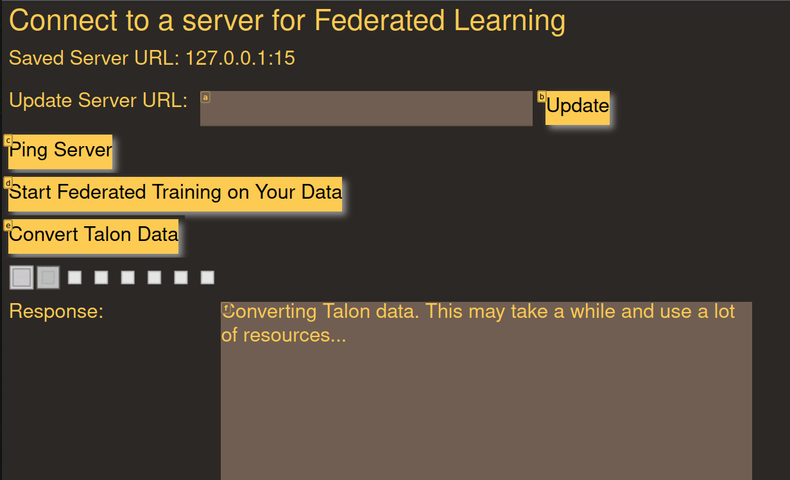

\begin{abstract}
For individuals with health limitations, machine learning provides a powerful way to create more useful accessibility software. Voice controlled accessibility software is one such example that allows many to interact with their computers hands free.

However, many models related to specialty tasks like accessibility suffer from a lack of data, well trained models, or an ecosystem through which to share them. Machine learning tasks for accessibility software often lack corporate incentives and thus depend upon community-led, manual solutions that potentially compromise privacy.

In my paper, I describe a novel way to apply federated learning for voice-based accessibility software. Federated learning allows models to be trained without exposing sensitive voice data to a central server. My software seeks to reduce the complexity of the federated learning process for end users and allows users to use their data generated from existing accessibility software programs. The models produced from the federated learning process can be used to build the backend for new voice control software on mobile devices. Throughout this paper,I describe the technical implementation of this solution and the user experience goals that informed my design.

Finally in the last section of the paper, I discuss a new platform, Linux mobile devices, where voice control and general accessibility is lacking. This platform is a useful case study to explore new ways of creating accessibility software. I provide a survey of user interface options on this platform and explain what needs to be done to integrate federated learning models. At the end of the paper, I explain the implications for the future of accessibility software.
\end{abstract}

## Acknowledgements

I would like to thank my advisor, Professor Kyle Jamieson at Princeton University for his advice and insight throughout the research process.

Any existing code adapted for this project was fairly used in accordance with the terms of the Apache, BSD, or MIT licenses. Relevant licensing information is at the top of the corresponding file within this project repository located at [https://github.com/C-Loftus/Princeton-Thesis/](https://github.com/C-Loftus/Princeton-Thesis/). When implementing the technical algorithms and general structure of this monorepo, I used built upon and modified code and design principles from

- [https://pytorch.org/tutorials/intermediate/speech_command_recognition_with_torchaudio.html](https://pytorch.org/tutorials/intermediate/speech_command_recognition_with_torchaudio.html)
- [https://flower.dev/docs/quickstart-pytorch.html](https://flower.dev/docs/quickstart-pytorch.html)
- [https://testdriven.io/blog/fastapi-react/](https://testdriven.io/blog/fastapi-react/)

# Introduction

With the advent of smartphones and higher powered personal computers, everyday individuals now have access to a huge amount of personal data. While this data driven environment has downsides, it can also be used for community-driven data sharing and the creation of new machine learning datasets. For instance, health data from fitness apps or recordings from voice dictation software are both datasets that, although sensitive in nature, could provide significant benefits to the greater public. To use this type of data at scale, we need not only new machine learning algorithms that preserve privacy, but also ways in which users can share this data in a trustworthy and intuitive way.

Despite this potential, many new machine learning techniques or ways of privately aggregating data remain completely abstracted away from the end user. Users are not told what data is being generated, where it is going, and what sort of models are being trained. The technical goal of efficient models are thus prioritized over any social or user experience goals. Companies who use algorithms like federated learning for training models privately are generally not concerned with giving users data autonomy or participation in the machine learning process. It is primarily done to reduce the liability that would otherwise come when collecting identifiable health data. As a result, federated learning and other privacy algorithms for machine learning have rarely been implemented within user-facing applications or for nontechnical users.

My goal is to broaden the scope of the privacy-preserving machine learning technique, federated learning, and show how users of all backgrounds can participate in the training process. I want to bring federated learning in conversation with ideas from user-experience design, accessibility software, and community-based organization. Accessibility software is a field that is in need of free public datasets and new machine learning algorithms to preserve privacy among contributors. We also need the qualitative insights from human-computer-interaction and user experience design which can teach us how to make intuitive software for people of all abilities. By combining these fields we can create software that is both highly intuitive for the end user and practical for creating performant machine learning models.

My goal in this project is to create a full federated learning ecosystem for voice controlled accessibility software. Voice controlled accessibility software allows users to control their computer through voice commands, without using a keyboard or mouse. As a result, it needs performant voice-to-text-models. In order to accomplish these machine learning goals, I define a voice model architecture, create a central server for controlling the software, and design a client for training on local data. Instead of abstracting away federated learning, it can be intuitively presented in such a way that invites people of all backgrounds to participate in new data sharing technologies. Additionally as of yet, the fields of accessibility software and federated learning have been completely separated. My goal is to bring them into conversation and create a practical example of how to integrate the two from both a technical and qualitative design perspective.

At the end of the paper, I discuss Linux mobile devices as a case study for how to bring federated learning and accessibility software to a new platform. This platform is new and experimental, and as such has unique perspectives on designing user interfaces. Analyzing these new perspectives will help us to better understand not only our end users, but also the sorts of properties we need in our final model and client. I complete this section by discussing two emerging options on this platform, SXMO and Numen, their unique design philosophies, and what code needs to be developed next to fully integrate federated learning.

All of the code for this paper and project can be found at [https://github.com/C-Loftus/Princeton-Thesis/](https://github.com/C-Loftus/Princeton-Thesis/).

With this outline in mind, it is useful to give a brief introduction in more detail to the three fields that I will expand upon in my thesis: federated learning, computer accessibility, and qualitative design more generally.

## Federated Learning

Federated Learning is a machine learning paradigm that seeks to solve many of the issues regarding privacy in traditional machine learning. In traditional training, clients are required to send their data to a centralized server and trust it will take the appropriate protections to anonymize it. However,in federated learning, all training is done on user devices. Then after training is finished, only the model weights are sent the central server. The training data itself stays on user devices.

Essentially what this means is that the server never sees the data, and thus the data is not subject to the same privacy concerns as in traditional machine learning. This is a particularly useful paradigm for health applications. It allows data autonomy without needing to compromise on the use of large-scale datasets. Users can share model weights with non-profits and community initiatives without having to worry about the security of their data.

Currently within industry, federated learning has been successful particularly within mobile computing like smartphones or IoT devices. Companies like Google and Apple have been able to leverage federated learning to train models on datasets like keyboard data that contains lots of identifiable information and is often too sensitive to train on. [@federated-personalization] [@flair] Models like these are the backbone for predictive typing software that can be both private yet also personalized to the individual user. However, as of right now, federated learning is still an emerging research area and usually is abstracted away from end-users. Within companies, there is little incentive to give users autonomy over their data, much less for technical federated learning. However this is exactly where innovation needs to occur if we wish to create new specialized accessibility solutions and take advantage of the wealth of user data.

## Relation to the Field of Computer Accessibility

While there are many domains that will benefit from this paradigm of data sharing, one of the most promising and the focus of this paper is voice controlled accessibility software. This software allows users without the use of their hands to control their computer without typing or using the mouse. For this type of software, it often relies upon huge voice datasets. While these models have good performance in general use, users may want to fine-tune them for specific applications that would otherwise not be contained in a general-purpose dataset. For instance, Mozilla's Common Voice \footnote{\url{https://commonvoice.mozilla.org/en}} is a great dataset for general voice recognition, but may not be enough to train models for users with a particular accent, speech impediment, or job specific technical vocabulary.

As of right now, accessibility applications often are supported through grassroots communities and the manual data contributions of individual users. Within such social arrangements, there is often a compromise regarding either efficiency or privacy. If telemetry data is automatically collected and sent to a central server, it may compromise sensitive information. A user may also not feel comfortable sending accessibility data to a central server, given it could be reused elsewhere without their knowledge. However, if we rely upon users to filter out their own data and only send a portion they are comfortable sharing, this may be too tedious and provide too little data.

As a result, the fact that no training data needs to be sent to a central server makes federated learning particularly useful for voice controlled accessibility software. In theory, it solves both the issue of efficiency and privacy at once.

## HCI and Design Work

In addition to the quantitative, algorithmic side of federated learning, there are a series of new design challenges for accessibility engaging users of all backgrounds. Since we are looking to build models for voice based accessibility, we need to make sure that the training clients for the users are also accessible entirely via voice.

For those without full use of their hands, many types of software interaction can be difficult or annoying to navigate with voice controlled software. For instance, not all desktop programs expose an accessibility tree or have good keyboard shortcuts for scripting actions. \footnote{\url{https://acrobat.uservoice.com/forums/590923-acrobat-for-windows-and-mac/suggestions/39448096-acrobat-reader-for-mac-does-not-expose-an-accessib}} As a result, I wanted to build all my user interfaces with a web ui. Internet browsers have much more accessibility tooling built in and are generally more accessible.

### Rango:

One specific tool that I want my software to support is Rango. \footnote{\url{https://github.com/david-tejada/rango/}} This software integrates with voice accessibility software and allows the user to navigate the web with just voice. It places small letters called 'hats' over HTML elements, which the user can navigate to by saying the letter names. Thus, by creating my user interfaces for the browser, I can take advantage of these already existing tools for better accessibility.

### General User Accessibility:

Finally, in addition to the accessibility aspects of our design for federated learning paradigms, we will also need to ensure ease-of-use. Most users are not accustomed to dealing with data in a decentralized way. Even among tech enthusiasts, most people are unfamiliar with federated learning. Users may think something is wrong when local training is in process and uses lots of system resources. We need to make it clear who has control of what data and during which parts of the process. This helps to demystify federated learning and foster a general ethic of data autonomy.

# Background

In this section, I will give a general overview of the existing field of voice-controlled accessibility software, federated learning frameworks, and the design principles that inform them. This context will help to better explain the overall architecture and software engineering choices I made while developing my software.

## Impediments in Machine Learning for Health

Before discussing the technical details of federated learning, it is useful to give some background regarding machine learning for health and why it is so difficult. In recent years, machine learning has created significant advances across healthcare and accessibility. Sophisticated machine learning applications have emerged for drug discovery, disability accommodations, patient monitoring services, and much more. [@10.1145/3167486.3167551] Advances in reinforcement-learning now allows for vital healthcare applications to be deployed even in novel environments and [@10.1145/3477600] new ways of optimizing and distributing training have allowed for models to be trained with more limited data sets [@10.1145/3427796.3433935].

Despite these algorithmic advances, the logistics of healthcare data continues to make it one of the most challenging data sources for machine learning. It is subject to particularly strict legal regulations and the stakes for user privacy are often much higher than other social data. For instance, in the case of automatic diagnostic software, even if the model performs well, steps must be taken to ensure patient privacy throughout the training process.

Thus, in order to do machine learning for healthcare in a traditional setting, data must be rigorously anonymized and stored in secure computing environments. While this is theoretically acceptable, in practice it often fails. This is usually the case for a few main reasons.

### Trusting Legacy Systems

When patients trust hospitals with their data, they are often in turn trusting legacy computing environments. Some may also have understaffed or underfunded IT departments. Due to how complex and old many healthcare IT systems are, it is only a matter of time before something goes wrong. Thus, what often happens is what is known as "normal accident" in sociology [@GVK021392943]. Even a small human error can cause a massive loss of data. Thus, we shouldn't necessarily be surprised when such a breach occurs, given the incentive for hackers and chance for so much to go wrong with just one mistake.

### Anonymity is Often Not Truly Anonymous

Many healthcare facilities will preemptively protect patient privacy by only storing anonymous data. That is, data that is decoupled from identifiable information like names, places of residency, or other public info. Yet despite this, is often difficult to preserve enough useful information while still having anonymity. Studies have shown how anonymizing patient data often falls short with regards to data privacy. Many techniques exist for reconstructing and de-anonymizing such datasets. [@langarizadeh2018effectiveness] While methods have improved, it is impossible in principle to have an assurance of total privacy when sending data to a centralized system.

### Patients Don't Have Data Autonomy

In the US, patients are not expected to manage their own medical data. Most hospitals and small healthcare providers have their own medical databases and manage patient records with proprietary software. While this is fine from a business perspective, it can be cumbersome for those looking to export and manage their own data. This can make it difficult to share data with non-profits or community initiatives.

<!-- Finally, centralized data storage may not always be the appropriate method as our amount of data continues to scale. In 2020, worldwide medical data collection was estimated to be in the realm of 25 exabytes.[@10.1145/3010089.3010143] -->

We need privacy solutions that can accommodate these other forms of data sharing while still being able to incorporate new machine learning models. It is my belief that federated learning can operate at scale to solve these problems and provide significant privacy benefits at the same time.

## Federated Learning Context

Now that we have discussed why federated learning is useful for current problems within machine learning for health, it is useful to describe the current research trends in federated learning, federated software more generally, and how they are currently implemented. This will allow us to see the shortcomings of federated techniques, and potential for innovation. When we discuss accessibility software, it will give us a better perspective on how to integrate these two technologies.

Federated Learning, despite being such a new and promising field, is based upon a much simpler and older one: federation. Federation as a general concept in computing is a backbone to many of the essential software tools we use every day. Email and `git` are two great examples of fundamental software technologies that are built upon federation. Anyone can start their own email or `git` server, control their own mail inbox or code repositories respectively, and choose to communicate with other servers of the same type. Despite the fact that these technologies are built upon federation, in reality the majority of individuals depend upon highly centralized applications (Gmail and Github, being two examples, respectively). As a result, if we want federated learning to break this general trend within federated software, we need both incentives and intuitive tooling to support independent communities.

For examples of user behavior with federated software, we can look to recent studies regarding the behavior of users in other federated networks such as Mastodon. Mastodon is an alternative social media platform that anyone can self-host and federate with other instances. This allows for decentralized data sharing and moderation. However, even though the software is designed for decentralization, users often congregate towards centralized servers. [@10.1145/3355369.3355572] After Elon Musk bought Twitter and caused many users to seek alternative platforms, Mastodon saw a huge influx of new users. However, many of these users were confused regarding which instance to use, and how their data was being retained. \small\footnote{\url{{https://www.newyorker.com/culture/infinite-scroll/what-fleeing-twitter-users-will-and-wont-find-on-mastodon}}}

Thus even though Mastodon is a social network and not a machine learning toolkit, it is a good example to show how users are not accustomed to dealing with federated systems and decentralized data. When implementing new forms of data sharing we need not only new technical solutions, but also new design strategies. After all, our goal is to share data in a way that is both efficient and democratic. Little will be accomplished at scale if only power users and hobby hackers participate.

With regards to federated machine learning specifically, programmers often completely abstract away the federation process. Despite the fact that nearly most mobile phones use some sort of federated learning techniques, it is usually always hidden away [@federated-personalization]. Under this understanding, federated learning is viewed simply in a technical light, and as a result the technical algorithm is considered too complicated for the average user.

Many papers in federated learning follow suit and do not deal with the social or design aspects of the the technology. They are primarily focused with attributes like energy efficiency or fault tolerance [@10.1145/3554980] [@10.1145/3556557.3557952]. While these are undoubtedly important attributes, it is certainly not the entire story. Given the fact that so much of the internet's monetization model is based around data collection, changing the way data is shared at scale could have significant social and economic consequences.

As we design for the future, it is important not to abstract away the decentralized and community driven potential for federated learning. When designing new applications we should not only focus on the technical aspects, but also trying to make it intuitive for users of all abilities and organizations of all sizes. This is one of the key aspects missing in current federated learning literature: there is not a clear vision for how to apply it beyond large companies, explain federation as a concept, and get non-technical users involved in the training process.
We will need to overcome these challenges for federated learning to go beyond just industry adoption and eventually see it come to fruition in non-profits, online groups, and community organizations.

## Accessibility Software

Now that we have the general background of federated software and federated learning more specifically, it is useful to survey the general landscape of voice based accessibility software. Unlike federated learning, lots of the cutting edge and most used accessibility software does not come from academic research or big tech. See for instance the software project, Cursorless \footnote{\url{https://www.cursorless.org/}}, a community driven solution for voice programming.

Thus in this section, I will give a summary of the different programs available, their general userbase, and the design philosophies that inform them. In general, within voice controlled accessibility software, many of the design philosophies behind different programs can be grouped into two main categories. Namely, application specific or general purpose accessibility software.

## Application-Specific Accessibility Software

Application-specific solutions are the first main category of voice based accessibility tools. These are often the solutions people are most familiar with and are built specifically for one platform like a web browser or smartphone app. In this model, it is up to each program to implement its own accessibility tools. One example is the extension LipSurf. \footnote{\url{https://www.lipsurf.com/}} This extension allows users within Chrome to control their browser with just voice. It takes advantage of browser specific accessibility APIs and thus does not provide any control of other desktop applications. While this is a downside for power users, it can also be a benefit for nontechnical audiences. LipSurf is very easy to install and use, and the scope of the project is very clear. It makes no pretences of trying to support other desktop applications. As a result the developer and community can focus entirely on web tools.

Voice assistants like Siri or Alexa, could also be said to fall in this category. These solutions are not primarily focused on customizability and are generally restricted to specific operating systems and platforms. Despite their restrictions, these solutions are popular given their simple commands and intuitive user experience design.

## General Purpose Accessibility Software

General purpose accessibility software is the other philosophy behind the design of voice based accessibility software. Under this design philosophy, the user runs one large voice control program that can interact with the entire computer, not just one application. Such programs often support their own scripting language for custom behavior. While this software style has much more potential for general use, it is also harder to learn for new users. As a result, the userbase tends to be made up of more technical users who are willing to experiment, and disabled users who rely upon it as their primary way of computer interaction. For the developers, it is also a greater development burden given the fact that they need to design around the entire desktop, and not just one application like the browser.

## Dragon

The first and perhaps most well known example of this sort of accessibility software is Dragon. Dragon is a proprietary voice control program that has been around since the 1990s (and even earlier with early builds). It is heavily marketed towards enterprise and business customers and tends to be focused on providing functionality for industries like healthcare, legal services, and general office work. While Dragon has innovated on many fronts over the years, it currently only supports Windows. Given its proprietary licensing, it can be hard to extend and customize. As a result, many users of Dragon (especially those looking to perform specialized tasks like computer programming) have begun to adopt other tools.

## Talon

The other main option for general purpose voice control software is Talon. \footnote{\url{https://talonvoice.com}} Talon is similar to Dragon in that it uses voice commands to control the entire Desktop. However, it is more customizable and cross platform on Windows, Mac, and Linux. As a downside, it does not support mobile devices. Upon downloading the program, Talon provides little functionality and only contains a voice-to-text model with associated Python libraries. However, there is a large community repository of Talon scripts that build upon these libraries called Knausj Talon. \footnote{\url{https://github.com/knausj85/knausj\_talon}} These can be imported and customized as desired.

Given the fact that Talon is so customizable, there are user scripts for doing nearly anything you would want on your desktop: anything from coding by voice to playing video games. These solutions are often more customizable and efficient given the fact that their designers are often also part of the Talon community as users.
One of the benefits of Talon, and one specifically related to federated learning in the context of this paper, is that you can enable the option `Save Recordings`. This saves every voice command a user says to Talon as a `wav` file and labels it with the output of the voice-to-text model. Thus, it is very easy to generate a personalized audio command dataset when using Talon.

The most commonly used commands in Talon are the phonetic alphabet, key names, and numbers. As such, it can be expected that many users have a large dataset of these sorts of commands. The alphabet is so commonly used given the fact that it is an easy way to refer to discrete elements on the screen. For instance the program [Rango](#rango) builds upon Talon and labels each HTML element with a unique combination of letters. This that allows the user to select by simply saying the letter. This alphabet is distinct from the NATO phonetic alphabet in order to be quicker for voice commands. Thus to summarize, these commonly used commands in Talon also share our goals for training and future machine learning models. We want training data that is common across many users and concise enough to train new speech command models.


From more info regarding the design of Talon and its basic functionality one can consult the community wiki or one of the many introductory articles on the software. \footnote{\url{https://talon.wiki/}}\footnote{\url{https://whalequench.club/blog/2019/09/03/learning-to-speak-code.html}}\footnote{\url{https://www.joshwcomeau.com/blog/hands-free-coding/}}

## Current Challenges in Voice Controlled Accessibility Software

While both of these voice control solutions work well for many, each has a downside. The core code of both Dragon and Talon is closed source. This may be a downside for privacy conscious individuals, or users working in restricted environments like government or healthcare. Dragon is also not free, and the license cost may be a significant impediment to many users. Finally, Talon and Dragon do not support mobile devices and lack a way of automatically sharing data in its ecosystem. In Talon, contributing data to use for future model training involves a manual process of sending recorded data to the developer.\footnote{\url{https://noise.talonvoice.com}} As of right now, Talon and its design philosophy has not yet been brought into conversation with the emerging field of federating learning.

As a result of this research, I found numerous research opportunities in voice controlled accessibility software. Many of these research questions regarding data privacy and the design of accessibility software on mobile devices fit well with our goals for federated learning. Talon specifically is a particularly advantageous community for testing federated learning. Users can generate large automatically labeled datasets that are highly individualized. Without federated learning this data output from Talon would likely be too sensitive to use at scale or tedious to anonymize manually.

## Linux Mobile Devices

As we saw when describing the current landscape of hands-free accessibility software, a significant amount of the issues come from the fact that parts of the ecosystem are closed source and do not support mobile devices. Additionally, even though Talon can automatically produce a personalized and labeled dataset, there are not any devices or ecosystems which seek to take advantage of this.

As a result, for my research, I was also interested in exploring Linux smartphones as a target for my model. Linux smartphones are unique in the fact that they are mobile devices that can also typically run any desktop Linux software, so long as a ARM-build exists. This greatly reduces the friction for users that seek to migrate between desktop and mobile devices. In addition to these technical benefits, the users of these new open source mobile initiatives are often looking to gain data autonomy and participate in grassroots social computing initiatives. This makes them more likely to participate in federated learning technology and use the resulting models.


By building software for a new ecosystem like Linux mobile devices, I wanted to not only solve an existing problem in the voice controlled accessibility ecosystem, but also anticipate future issues that will come about due to a lack of accessibility support on new ARM mobile devices.

Finally, as previously stated, Linux mobile devices can more easily run existing Linux software than alternatives like Android or IOS. This will allow me to experiment with a wide variety of user interfaces on top of my model. For instance, I can use and or adapt my previous research developing an open source voice control solution for Linux \footnote{\url{https://github.com/C-Loftus/Starling}}. This experimentation will allow us to consider new design and accessibility perspectives that may have been overlooked on more traditional platforms.

# Architecture Design

My project goal was to create a full-stack federated learning system for voice controlled accessibility software. I wanted to create an ecosystem to show how federated learning could be practically applied to a real accessibility software community. These goals helped to guide my software engineering methodology and the technologies I used.

When designing my architecture I was focused on both technical efficiency but also user accessibility. Namely for the latter, I wanted to design solutions that worked well for users who use only voice. I also wanted to consider accessibility from a more abstract standpoint. Namely, how can I design components like a backend API to be more accessible? It is important that I design the architecture in such a way that is not opaque and allows for community contribution. I want users of all backgrounds to be able to clearly trace the path their data takes throughout the machine learning process. While these alternative forms of data sharing should be visible on the user interface, it should also be visible in clean, decoupled code.

With this in mind, I split up the technical implementation of my project into four main parts.

- Machine Learning Architecture and Algorithms
- Webserver Backend
- Webserver Frontend
- GUI Client for participating in federated learning and converting Talon data


With regards to the technical goal of this architecture, it was intended to make it so both a server administrator ( the person that will eventually get the final trained model ) and existing Talon users can easily start a federated learning training process. They should be able to do this without needing to have any knowledge of coding. In addition to the user experience goals, the technical design is loosely coupled and is thus easier to build upon in the future. For instance, since the federated learning process can be controlled through a web API, users can develop their own clients or integrate their own ways of parsing Talon user data. My architecture provides a useful default client but users can design their own interfaces as well.

# Implementation

With this background in mind, I will now proceed to discuss the implementation of my software and the various challenges I overcame. As stated previously, I sought to create software for implementing a full federated learning ecosystem. Each part of this ecosystem has a decoupled architecture which will allow new innovations to add features to specific parts of the system without needing to change others.

## Codebase Walkthrough

All of the code for this paper and project can be found at [https://github.com/C-Loftus/Princeton-Thesis/](https://github.com/C-Loftus/Princeton-Thesis/).This codebase is set up as a monorepo. The folder titled `doc` holds all documentation including the code used to generate this thesis from its markdown source. `server` holds the code for the central federated learning server and all code for aggregating weights or controlling the system from its web API. `client` holds all the code that a user needs in order to do local training and interact with the server. `frontend` holds the React frontend for the central federated learning server. Finally, `numen-modifications` holds any code related to linux mobile devices, scripts to interact with such devices through voice, or modifications to existing software like [Numen](#contextualizing-numen).

To build and replicate any software in this repository, there is either a `makefile`, `package.json` , or `pyproject.toml` file in each directory. A `.pythonversion` file specifies the proper version of python to use (python 3.8.14) and it is recommended to use `pyenv` to control Python versions to match and avoid any version errors. All testing was done on Ubuntu 22.04 but should work cross platform with few modifications.

### Important Factors Before Training

By default this codebase uses all local IP addresses. For training with devices outside your network, you will need to change these constant values to an internet-facing IP address. These constants are generally defined at the top of Python files in this codebase. Once you have your desired network configuration, you need to have a sufficient amount of audio data to train. If you are a Talon user, you can generate this data by enabling the `Save Recordings` option. Otherwise, you can use the SpeechCommands dataset as a benchmark. Please see the scripts located at `client/scripts` for programmatic ways to initiate training with or without Talon data.

## Federated Learning Implementation

The first and most essential part of my project was implementing the technical code for federated learning. These machine learning and aggregation strategies affected not only my decisions regarding modeling, but also principles of user experience design.

The first thing I had to do was make a decision regarding which federated learning library to use. Currently there are a few main options, namely `fedjax` [@fedjax2021], `Pysyft` [@DBLP:journals/corr/abs-1811-04017], and `flwr` [@beutel2020flower]. While a comprehensive comparison of all options would be beyond the scope of this paper, I chose to use `flwr` (also known as Flower). This library allows you to apply federation strategies to existing models in popular frameworks like PyTorch and Tensorflow. `flwr` thus allows you to focus more on modeling and abstracts away aspects of federated learning like networking and error handling that are less relevant to this project.

With this decision in mind, I then had to choose a model upon which I would implement federated learning. I had a few main goals for this model given the fact that it would be used on lightweight Linux mobile devices.

- It must be a model capable of processing human speech in English
- It should be feasible to train without a GPU
- The model itself should be small and easy to run on a mobile device
- The model should be focused more on short commands rather than dictating sentences

As a result, I decided to use the M5 voice-to-text model architecture. [@https://doi.org/10.48550/arxiv.1610.00087] This architecture is designed for making inferences on raw waveform data without needing to do extra processing. Compared to larger conformer or wav2letter models, M5 requires less cpu and memory resources to run. These properties also makes it easier to deploy the model to mobile devices that may have limited disk space or nontraditional package management.

With regards the technical aspects of this model, it takes advantage of deeply layered convolutional neural networks. This allows the model to have more fine grained classification but the paper describing its implementation says it remains relatively resource efficient to train and process inferences. For instance the paper says how "By applying batch normalization, residual learning, and a careful design of down-sampling layers, we overcome the difficulties in training very deep models while keeping the computation cost low." In the paper describing this model [@https://doi.org/10.48550/arxiv.1610.00087] they use the `UrbanSound8k` dataset and tried to distinguish between different noises in a city. While this dataset is different from the speech commands used for voice controlled accessibility software, it is a good baseline metric for determining the models performance on classifying discrete noises in a noisy environment. This is an essential property for voice controlled accessibility software.

## Client Implementation

After implementing the model in Pytorch code \footnote{I was able to build upon an existing implementation located at: \url{https://pytorch.org/tutorials/intermediate/speech_command_recognition_with_torchaudio.html}}, it then became time to integrate it with `flwr` and federated learning. In `flwr`, it is up to the user to implement 4 main functions on the model. These functions describe how the model will be fit during the training process and how to pass model weights to the central server after training has finished.

```
class FlowerClient(fl.client.NumPyClient):
    def get_parameters(self, config):
    def set_parameters(self, parameters):
    def fit(self, parameters, config):
    def evaluate(self, parameters, config):
```

As previously stated, in federated learning all training happens on device and then the model parameters are exported to a central server where they are aggregated in some way. This preserves privacy but also takes advantage of the benefits from a large user base with lots of training data.

My implementation can be found in the repository at [client/training.py](../client/training.py) \footnote{I was able to use the `flwr` Pytorch tutorial as a base to build upon: \url{https://flower.dev/docs/quickstart-pytorch.html}}. With regards to the details of the implementation, I use negative log likelihood as my loss function. This is given the fact I am doing multi class classification over audio data and want a final probability distribution over labels that sums to one.

Next, I spent a significant amount of time testing and optimizing batch size during training. This is given the fact we want average people to be able to train the model and thus we need to focus on reducing the load of system resources. These questions of optimizing hyperparamters provide a more nuanced perspective to how we think about accessibility in machine learning. While we often think about accessibility as a user-facing property, it can also be a technical or algorithmic one. Resource intensive training can limit users with lower end hardware from participating in software communities. Simpler models and optimizing our hyperparameters for faster training make it so we can engage with the largest possible audience.

## Client Training Data

Now that we have defined the overview of my model architecture I will describe the training data that can be used to train the model. This data can be user generated from Talon as we mentioned, or from preexisting open source datasets. One example of the latter is the `SpeechCommands` dataset. I was able to take advantage of existing research and repositories using this combination of the dataset and M5. This helped to provide a baseline for the start of my training process. \footnote{\url{https://pytorch.org/tutorials/intermediate/speech_command_recognition_with_torchaudio.html}}. This dataset is a series of roughly thirty different common words that could be used as commands: namely, words like common names, numbers ,and directions. This is a useful dataset for testing federated learning performance before new user data is factored in.

The next source of user data is from user generated datasets. As spoken previously, [Talon](#talon) is one of the most commonly used community driven voice control solutions. Talon commands use natural language to control the desktop in an intuitive way and automates many tasks that would otherwise require the use of a keyboard. Talon can also call python scripts or dictate full paragraphs. For context, some example Talon commands include:

- `focus firefox`
  - (focuses the application Firefox)
- `new bookmark`
  - (example of a custom, application specific command that only triggers in certain contexts)
- `press control shift enter`
  - ( example of a keypress commands)
- `the quick brown fox jumps over the lazy dog`
  - (example of a dictated sentence)

When dictating these sorts of commands, Talon allows users to automatically generate labeled recordings as they use the software. This is usually used for debugging purposes, but it can also be used to generate a dataset for training future models.

By default Talon outputs its data in a `.flac` format and it includes every single parsed audio statement. As a result it includes audio of variable lengths, some of which may be too long or contain words which are too niche and specific to a given user. Thus, to convert the audio data into a full dataset that can be used for training, I wrote a script located at [client/scripts/parse_talon.py](../client/scripts/parse_talon.py). Once the user data is filtered through this script, the user will have a curated dataset of speech commands that can be used with the M5 model above. To ensure that only useful commands are making it into the training set, the central server can define a schema of commands. A central federated learning server administrator can decide which command names the community should train with. By default the commands are the most common ones said in Talon, namely the names of letters ( according to a phonetic alphabet), numbers, and common key names (enter,home, etcetera). During my research, I have not seen any other projects take advantage of Talon data in this way. Thus, my implementation is relatively novel and potentially useful for other projects looking to source new sets of audio data for accessibility purposes.

## The `flwr` Federated Learning Server

Now that we have described the model and the data, it is important to clarify how the `flwr` server is set up and relates to the rest of my code. To begin the entire federated learning process, a server administrator will launch the `flwr` server. This will open a port for clients to connect to. It is up to the clients to use their data and train the models locally. Once a training epoch has completed, the parameters will be sent to the central `flwr` server and an aggregation function will be ran. This aggregation function takes all the individual weights and synthesizes them together to create one final result.

### Federated Learning Aggregation Strategies

In federated learning, the `flwr` server needs to make a decision regarding how to aggregate the weights from the different clients. Specialty aggregation strategies can be used to compensate for high variance in user data or technical limitations among the clients. Such limitations may include battery power, network connection, or processing power. As such, it is important that we select a default aggregation strategy that is favorable for our specialty use case. In this section, I will be analyzing the different options. I will refer to aggregation strategies as they are referred to within the `flwr` library.

When deciding to use a strategy, it is important to consider how many of the following properties hold: [@https://doi.org/10.48550/arxiv.1602.05629]

- Non-IID: Whether or not a certain dataset will be representative of the population distribution
- Unbalanced: The number of samples per user being much different
- Massively Distributed: The number of users being very large
- Heterogeneous: The users' devices are different (e.g. different hardware, different operating systems, different software versions, etc.)
- Limited communication: The users' devices are not necessarily connected to the internet all the time, or have limited bandwidth

The most well known federated learning algorithm is FedAvg, this appeared in the same paper where the term "Federated Learning" was coined.[@https://doi.org/10.48550/arxiv.1602.05629] This algorithm works by randomly sampling from the users and averaging their update weights. However, this algorithm has some limitations. If we have particularly unbalanced data, the algorithm may not aggregate between clients well. For this reason, the algorithm Federated Average with momentum, also known as FedAvgM, was proposed. This strategy helps to eliminate the unbalanced data problem by using a momentum term to help the algorithm converge to a better solution. [@https://doi.org/10.48550/arxiv.1909.06335] This algorithm uses a gradient history to reduced variance during training. As a result, this algorithm also has the favorable property of being able to generally train more quickly than FedAvg.

While approaching training from perspective of data distribution is one way to approach the tradeoff, we can also use strategies that try to limit network communication between the client and the server. One such strategy is known as QFedAvg. This strategy uses a quantization technique to reduce the amount of data that needs to be sent between the client and the server. [@https://doi.org/10.48550/arxiv.1602.05629] This strategy is particularly useful when the clients have limited network connectivity. If network speed is not the issue but rather interruptions in the connection, we can use FaultTolerantFedAvg. This strategy behaves similarly to QFedAvg but focuses on avoiding connection errors caused by an unreliable network instead of the amount of data sent. Both of these strategies are particularly suited for embedded IoT devices or nontraditional computing locations.

Finally, we can also modify and use adaptive optimization methods from traditionally non-federated algorithms. For instance, using federated versions of Adagrad, Adam, and Yogi makes our systems easier to tune and gains more favorable convergence behavior. [@https://doi.org/10.48550/arxiv.2003.00295] The downside is that FedOpt, FedAdaGrad, FedAdam, FedYogi all require "initial_parameters to be set" in `flwr`. This means that they are best used to improve the performance of an existing model.

`flwr` supports all of these aggregation functions and as a result I have built all these algorithms into my own program. However, it is important to discuss which should be the default strategy given the general properties of this machine learning task. As we stated previously, this task for voice recognition with Talon data has:

- A relatively small amount of users but a relatively large amount of data from each
- No existing publicly available models on top of which to train
- A shared subset of labels coming from a central schema on the server at training time
  - However between different users, there is likely to be high variance in the distribution of words
  - This is since the dataset Talon can be customized and the dataset is coming from natural usage, not a supervised collection process
- Relatively stable desktop internet connections

From these properties, we can see that training with Talon is actually a much different task than many of the classic federated learning challenges discussed in the original papers. [@https://doi.org/10.48550/arxiv.1602.05629] For Talon users, the main challenge is trying to converge relatively quickly with a relatively small amount of data. Unlike medical institutions or private companies, Talon users will likely be using their main desktop computers to train the model. As such speed is much more important. With this in mind, I chose to have FedAvgM as the default aggregation function. This algorithm helps to reduce the impact of the uneven data distribution you would see among user datasets. It does not focus as much on network connectivity like QFedAvg since we can assume that many Talon users have relatively stable internet connections. This is given the fact that the user demographic of Talon is generally technically literate students and professionals who most likely have stable internet. Finally, I did not choose any of adaptive optimization methods since we currently do not have any pretrained weights to use as a baseline.

In summary, voice data from Talon is not only an interesting data source that is easy to generate over a long period of time, but it also challenges many of our assumptions about federated learning. Many papers emphasize ways to overcome a bottleneck in power, network communication, or convergence time. When dealing with community organizations and specialty tasks like accessibility software, we need to factor in the social aspect. In this context, convergence time is not just a technical metric that affects cloud computing resources, as it would be in a large enterprise. Individual users with just one general purpose computer have a much lower tolerance for long running programs. As such, it is important for us to design our training scripts with these human-centered time scales in mind.

## Additional Backend Functionality

While `flwr` is an excellent technical library, it provides little functionality for end-user interaction. In this sense, it overlooks the community driven potential similar to other federated learning research mentioned in [background](#background) . By default, the server blocks the main thread and isn't intended to be interacted with while training. In order to get information like the amount of clients, whether training is in process, and networking information, it is necessary to extend the behavior of the default code.

This provided me with another opportunity to make federated learning more user friendly, specifically from a software engineering and development perspective. To extend the behavior of `flwr`, I decided to create another backend web application as a wrapper over the training server. This web application is used to create an API for useful metadata and controlling the training process. For my backend I used FastAPI. FastAPI allows for the creation of web apis in Python.

With regards to technical features, the wrapper over `flwr` is relatively straightforward. It makes training easier to monitor and provides human readable responses to `GET` requests. However despite this, there are once again interesting social implications with such design decisions. For us to achieve our accessibility goals, we sometimes need to consider underlying infrastructure that most users will never directly interact with. To achieve success with federated learning in a communal environment, we need to make it easy for developers and community members to get the data they need, not just server administrators controlling the central `flwr` backend. These sorts of design decisions help to reinterpret federated learning as a more community oriented technology. Even if software appears to be accessible, if it is not easily extended and maintained, these claims of accessibility will always be uncertain long term. \footnote{More information regarding how to foster accessibility in software development methodology can be found in this useful blog post: \url{https://about.gitlab.com/blog/2021/04/07/how-the-open-source-community-can-build-more-accessible-products/}}

## Webserver and Client Frontends

Now that we have described the entire backend and machine learning implementation, it is useful to describe the graphical frontends that control it. Once again, when creating different front end technologies, there was not only the question of feature richness and software efficiency, but also the question of how to communicate a complicated machine learning technique to a general audience.

Much has been written regarding how to make machine learning more intuitive for general audiences. [@10.1145/3334480.3375051] [@10.1145/3173574.3173704] [@10.5555/AAI28791133] However, much of this literature does not generalize to federated learning where average users are expected to invest a larger part in the process. Yet at the same time, they are also given greater data autonomy and privacy. We need to emphasize these distinctions in data sharing and user expectations in order to get the best user outcomes and final models.

Thus, I had a few fundamental goals when designing my interfaces:

- Clearly specify when federated learning is taking place
  - This will help to explain the use of system resources
- Include technical terminology but do not rely upon it
  - Federated learning and data autonomy shouldn't be necessary prerequisites, but they should be totally transparent for those looking to participate further
- Use sensible defaults and a few simple settings to reduce the chance of things going wrong
  - With federated learning, we rely upon aggregating weights generated from a training process we cannot directly observe
  - As such, we rely upon users to run our software without errors. Having users change things like hyperparameters could improve performance, but have a greater risk for causing errors

In many web applications, we often don't need to worry about what information is coming from machine learning models, verses human designed algorithms. For instance, it makes little difference to a user on a shopping website whether the recommendations are coming from linear regression, a neural net, or a look up table. All major computation will be happening on the backend and results can be cached to reduce latency. However, this is not the case in federated learning. In this scenario, training takes up a significant amount of user resources for a significant amount of time. This is especially the case with large data like audio or video.

As such, federated learning is a technique that should not be abstracted away fully, even for relatively novice users. Otherwise, they may assume something to be wrong when their device's resource usage becomes abnormally high. Examples of this design principle can be seen in screenshots of my user interfaces, both for the web server and for the individual clients. In both of these images, there is a clear indicator when training is occurring. I I also make sure to explicitly use terminology like the client server distinction, and explicitly refer to the technique of federated learning by name. This type of information is not necessary to understand for the average user,but can help to clarify where data is throughout the training process.

## Server Frontend

In a centralized machine learning paradigm, usually the central server has to have a complicated control panel for managing the training process. However, in federated learning since training is occurring on client devices,the server knows relatively little about the process until the finalized weights are sent to be aggregated centrally. As such, the central frontend does not need sophisticated functionality. The only info that is necessary is the aggregation strategy, the amount of clients, and the labels that all clients agree to train with. Thus as a result, the core principle of federated learning remains easily visible, but more specific technical details are unnecessary. For individuals who wish to learn more, `?` icons provide a place to learn more by hovering over them with the mouse.

The frontend for the central server was implemented using React. This was since this framework has preexisting tools for accessible user interface design and works well with [Rango](#rango). The library I used for this was Chakra UI. React is also good for accomplishing another one of my main goals: condensing everything into a single page application. This is not only more accessible, it is also simply easier to understand. It is important to note that this simplicity was only able to be accomplished by using the previously mentioned `FastAPI` backend. This allowed us to make the underlying `flwr` server more easily controlled and monitored.

<div style="display: flex;">
{width=70%}
</div>

## Client Interface

The second frontend I created was for the training client. Once again, I sought to make this interface simple yet not overly abstracted. The conversion of Talon data gets its own button because it is highly resource intensive for large datasets. We do not want to implicitly do this conversion without the user explicitly requesting it. Additionally, federated learning has its own button and is explicitly called by this technical name. Importantly, all other log information is passed through a response textbox to the user. This allows the central server to send custom messages and the user to easily see any training errors without needing to go into a terminal. This is important since machine learning training can often have issues that require the technical logs to resolve. Finally, the user can ping the federated learning server to see if it is running. Once the federated learning process commences, a gif will appear on the screen during training to signify it is in process. Upon completion it will go away and the textbox will be updated with a completion message.

<!--  -->

<div style="display: flex;">
{width=90%}
</div>

Both of these interfaces use simple high contrast visual styles in single page applications. The distinctly different colors helps to distinguish the two programs for those who need to use both. Additionally, in both applications all state is stored in a local `shelve` Python database. This is a simple database module built into the Python standard library. This makes it so the federated learning process will not be disrupted if the user interface is refreshed.

Finally, as mentioned in our section regarding [HCI and Design Work](#hci-and-design-work), both of these user interfaces use the browser. By building them on this platform, we can use cross platform accessibility extensions like [Rango](#rango).

<!-- ## Packaging and Distribution -->

<!-- As stated previously the goal of this project is not only to implement a full stack federated learning application from a technical standpoint, but also do it in such a way that is intuitive and user friendly. One of the core challenges confederated learning can also be viewed from a DevOps perspective: namely, packaging and distributing machine learning code to users with many different environments. -->

## Qualitative Design Choices and Accessibility

As stated in the [introduction](#introduction), one of the main goals of this project was to implement federated learning in a way that would be accessible for users of all backgrounds. It wasn't enough to simply make federated learning more transparent and user friendly. It also had to be done in a way that supported users that rely upon assistive technology.

As such, there were a series of essential principles that helped to guide and inform my design decisions. These principles are important not only in the context of this project but also for any software that seeks to be more accessible. I kept these principles in mind as I looked towards new platforms like Linux mobile devices. I synthesized much of this information by combining my own research with the design principles found in the Talon documentation.\footnote{\url{https://talon.wiki/}}

### Design Around Discrete Instead of Continuous Inputs

Whenever you are looking to control an application interface, you should look to use tools that have a declarative way of separating different content into components. The clearest example of this difference is seen in keyboard driven interaction verses mouse driven interaction. If you design software around the keyboard, it is also easy to control with voice. For instance, a keyboard shortcut can be replicated by using a program like Talon and telling it a command like "press control enter".

However, this cannot be done in the same way with mouse driven interaction. If the user is required to click a button like a GUI program with a toolkit like QT or GTK, this is much more difficult to do with voice. Instead of a clearly defined shortcut, the user has to navigate the mouse to a specific position. The alternative would be looking into the application code and trying to script the action. However this is not intuitive and is contrary to user centered design. It forces the user to look into behavior that is deliberately abstracted away to begin with. Put another way, it prioritizes the application over the user who actually interacts with it.

### Design around Web Interfaces

While many developers decry the loss in efficiency caused by rewriting application clients for the web instead of directly on the desktop, web interfaces provide a variety of convenient accessibility functionality. As mentioned previously in the paper, many programs for the desktop do not expose an accessibility tree. If they do, accessibility in general can often be a second thought for large teams, or a burden for small ones. On the contrary, web interfaces are an easier way to provide cross platform accessibility. As we mentioned in the previous section, web interfaces are split up into a series of discrete components (HTML blocks) beneath their styling. This makes it significantly easier to navigate with just voice with tools like [Rango](#rango).

Hence for this reason I chose to build the server frontend in React and used PysimpleGUIWeb (instead of PySimpleGUI desktop). I don't have to create separate accessible user interfaces for every platform. Additionally, web browsers are already well supported by other forms of accessibility software. For instance, for those who use screen readers it is often preferred to be able to navigate a website rather than desktop GUIs. ( For the same reasons as above: not all programs keep these sorts of users in mind when designing) Finally, accessible design is made even easier on the web due to the fact that UI libraries like Chakra UI for React abstract much of the technical details of accessibility away from the programmer. For instance, they don't need to worry as much about HTML style conventions since it will be compiled down from a higher level React component.

### Universal Design

With accessibility software, it is generally understood that the goal is to make computers usable for people of all backgrounds. However, to achieve this goal, some may go beyond and try to create software specifically for voice control. For instance, some users have created desktop environments \footnote{\url{https://git.sr.ht/~geb/tiles}} specifically for voice. While this is laudable work, I was influenced by principles of universal design [@10.1145/257089.257893] [@10.1145/257089.257893] and wanted to create software that bridged people of different abilities. We shouldn't necessarily try to create alternative platforms and applications specifically for accessibility. To do so risks the creation of splintered communities and abandonware. Accessibility should be able to be naturally integrated into existing workflows for people of all backgrounds.

This goal of universality also makes it easier for users to transition in and out of their accessibility software setups ( in case of varying health). Thus, the ideal accessibility software ecosystem is symbiotic: software should work well without voice, even better with it, and be easily decoupled if needed. This is yet another reason why building around the web with its robust ecosystem of extensions and developer tools is yet another good idea for accessibility software.

# Linux Mobile Devices: The Next Step for Accessibility Software

At this point, we have created a system for creating datasets from Talon, training models with federated learning, and controlling it all through an intuitive web interface. With this in mind, it is now useful to begin a discussion regarding how voice accessibility software will integrate into new platforms. These discussions are important since accessibility software is only as useful as the broader software system it supports. It is not enough to simply have good performance in our machine learning models.

This is especially the case on bleeding edge platforms like Linux mobile devices. While we may think that a voice control model can quickly be pushed to production, we first need to consider the fundamental accessibility software infrastructure.

Finally, as stated previously, new platforms like Linux mobile devices are not only interesting from a research perspective, but the platform is built upon social goals that overlap with those from our own federated learning project. For instance, most Linux mobile users tend to be tinkerers or privacy conscious individuals who care about data autonomy and are willing to use experimental software for these goals. Given the fact that the platform currently does not have an established accessibility solution, there is greater incentive to innovate and develop for this platform.

Just like on the Linux desktop, there are many options for mobile Linux phones each with their own design philosophies, technical tools, and target demographics. In general, Linux mobile phones are a relatively recent phenomenon and have nowhere near as much support as the desktop Linux community. As a result much of the development is entirely grassroots and community driven with very little corporate funding or academic sponsorship. Thus, I believe that this is even more of a reason why it is so important to develop accessibility tools as soon as possible for the platform. Without these tools, entire demographics of users will be left out from this new software revolution.

With this in mind, it is useful to begin a brief overview of the platform and its key properties.

## Open Source and Private by Default

Linux smartphones are unique in the fact that they are designed to be open source at all levels.
While Android can be rooted and custom roms can be installed on popular phones, this process is often difficult and not encouraged by developers. While many people point out how Android is open source, the size and monolithic nature of the code base makes it prohibitively difficult for average users to make contributions.

With Linux smartphones, the user has essentially any freedom they would have on the desktop. Specific hardware manufacturers have also arisen that align themselves with the same goals as the software community. One such company is Pine64. Their Linux smartphone called the `PinePhone` was used for all Linux mobile testing and development in this project. This device is relatively ubiquitous for the Linux mobile software community and as a result it supports nearly all software in the ecosystem. This is importance as it is not always a given given the wide variety of mobile devices, with unique hardware like cameras, modems, and environmental sensors.

## Multiple Options for User Interfaces

Given the fact that a substantial amount of existing desktop software can be ported to mobile, there are many options for both the OS itself, as well as the user interfaces. For context, these are analogous to what would be the desktop environments on a desktop Linux computer. While discussing the many intricacies of the different mobile operating systems is not of particular relevance to this paper, the different user interface options on the other hand have direct relevance to user experience and the design of voice controlled accessibility software. Each has a different philosophy regarding application GUIs, scripting, and user input.

Just as we did previously when discussing different types of voice controlled accessibility software, it is helpful to provide a brief overview of the state of mobile Linux user interfaces. There are three main options: Phosh,Plasma Mobile and SXMO. By enumerating their strengths and weaknesses it will help to contextualize the design of my federated learning system and why I chose a model for dictated commands like M5.

## Phosh

Phosh is a mobile Linux user interface based upon Gnome.Given the fact that many Gnome applications already support devices with small screen resolutions, many apps transfer over well with few modifications necessary. Generally speaking, the user experience seeks to mimic earlier versions of Android. There is an app drawer with graphical logos, menus that are accessed from swiping down at the top of the screen, and a gallery of running applications. As such, it is relatively user friendly and has already shipped on some commercial smartphones like the `Librem 5` from Purism. Given the fact that Linux smartphones are still in their infancy,Phosh has gained much support simply due to the fact that it is particularly stable and intuitive for those familiar with desktop Linux.


## Plasma Mobile

The next main Linux user interface is Plasma Mobile. Plasma Mobile has a similar design philosophy to Phosh, except for the fact that it is based on KDE, not Gnome. Once again it borrows a significant amount of its design philosophy from Android and iOS. Plasma mobile has a standard home screen of applications with GUI menus and homescreen widgets.


While much more could be said about both Plasma Mobile and Phosh, the fact is that they are largely seeking to mimic existing designed principles. They are primarily touch focused and have a familiar focus upon a homescreen with GUI applications. However, neither of these interfaces have had the time or money to develop to the level of Android or iOS. As a result, Linux accessibility on these mobile interfaces is sorely lacking. As stated previously, Talon and Dragon do not run on these devices. As we have seen as well, they are both entirely centered around touch input. They are essentially unusable for people with accessibility issues affecting the use of the hands. However, this is not the case for all user interfaces.

## SXMO

SXMO, (Simple X Mobile), is the third major mobile Linux user interface. However, it takes a significantly different design approach regarding both the user experience and the underlying software that powers it.SXMO is designed to be minimalist in nature and closer to the unix philosophy of simple, distinct, minimal programs. SXMO is not built on top of either Gnome or KDE. Rather it uses a highly modified version of DWM \footnote{\url{https://dwm.suckless.org/}} .DWM is a dynamic tiling window manager Linux desktops. This means that it automatically fits new windows to a grid or workspace as they are spawned.Traditionally this software has been primarily used by Linux enthusiasts looking for a lightweight and hackable desktop. For instance, there is no config file. To make any custom changes you need to edit the source code itself.

At first glance, this seems to be even worse in accessibility than both Plasma Mobile and Phosh. However this is not the case due to a series of modifications over DWM. SXMO, instead of prioritizing touch input, uses a series of context menus to navigate around the system. For instance, when you are in the terminal you can press the volume up key to launch a menu with application specific options. This provides a discrete, navigable interface that is easy to script, including with voice.

<!-- <div style="display: flex;" markdown="1">
{width=50%}
{width=50%}
</div> -->

<div style="display: flex;">
{width=50%}
</div>

<div style="display: flex;">
{width=50%}
</div>
<!-- - Copy
- Paste
- Zoom In
- Zoom Out
- Scroll Up
- Scroll Down
- URL Mode
- Hotkeys
- System Menu
- Close Menu -->

<!-- The behavior of the different keys can be found at [https://git.sr.ht/~mil/sxmo-dmenu/tree/master/item/dmenu.c#L592](https://git.sr.ht/~mil/sxmo-dmenu/tree/master/item/dmenu.c#L592). We care about

https://cgit.freedesktop.org/xorg/proto/x11proto/tree/XF86keysym.h

```
#define XF86XK_AudioLowerVolume	0x1008FF11   /* Volume control down        */
#define XF86XK_AudioMute	0x1008FF12   /* Mute sound from the system */
#define XF86XK_AudioRaiseVolume	0x1008FF13   /* Volume control up          */
``` -->

For context, SXMO was designed alongside many users using the `PinePhone`. This device has relatively low end specifications and a touchscreen that is rather underwhelming. As a result SXMO decided to use the volume up,volume down, and power buttons as discrete navigation options. Instead of trying to mimic Android and iOS it created its own mobile design philosophy. Namely, it provides a way to launch menus and navigate the device through with nested, configurable options. Then software developers can implement menu options for their application. Under the hood, it is simply controlling sets of shell scripts that the user can easily access.

As we discussed [previously](#qualitative-design-choices-and-accessibility), voice controlled accessibility software works best with discrete, clear labels as well as building upon existing interfaces, not replacing them. SXMO has many of these favorable properties. For instance, when a menu shows up on the screen, a user can give a specific input pattern to navigate to it. For instance, if they want to select the fifth item in a menu, they can click down five times, or if they have accessibility software activated, use a command like `five` to mimic pressing down five times. (And of course they can still use the touch screen as well). This menu system makes it easy to navigate via scripting, and thus also easy to navigate via voice. Although it made have not been intentional, this design draws upon principles of [universal design](#universal-design) we discussed previously. Namely, to make software accessible without needing to make it overly specialized just for accessibility. In our case, since we are navigating through menus, we can use short voice commands and not need to train an entire general purpose voice recognition model. As such, our federated learning system with the M5 model fits well alongside SXMO's design goals.

Another key element of SXMO is the fact that it is meant to be hackable. This means that menu actions can easily be edited in distinct shell scripts. It is even easy to extend the behavior of fundamental aspects of the user interface, such as the desktop itself.SSH is also well supported which makes the device feel like a small Linux desktop, more than a distinct mobile device. While this flexibility can be a challenge at times, the fact of the matter is that SXMO has a an exciting and unique way of thinking about mobile computing.

Thus, to summarize SXMO's design philosophy:

- make the system hackable and transparent
- don't harshly distinguish between mobile and the desktop
- try simple discrete input options before complex touchscreen ones

All these properties make SXMO a particularly exciting platform for research. It allows us to experiment with the next generation of accessibility software and alternative HCI perspectives. SXMO isn't trying to mimic iOS or Android, and that is exactly what makes it so interesting for exploring new forms of voice controlled accessibility software.( And the federated learning systems like our own that will support them)

Now that we have summarized the landscape of Linux mobile phones and explained the user interface properties that are desirable, I will explain what needs to be done to bring voice control to SXMO and create voice clients on Linux mobile devices generally.

## Developing a Client to Query the Model

After understanding the landscape of Linux mobile devices, the first thing I did was create a simple client. In the repository for this project it is located at, `numen-modifications/model-query.py`. It takes in a sample audio file and prints out the transcription. However, when developing this model, I realized that there was additional missing infrastructure that had to be addressed. In more established programs like Talon, the user can chain together multiple commands and restrict outputs depending on context. For instance, the user could write a simple script for a voice command like `start media player` and have that command only trigger when you are actually playing music. As such these sorts of behaviors need to be built on top of the model using some sort of toolkit.

### Integrating with Voice Toolkits

When discussing accessibly software, we saw how one of the most important decisions is knowing what [other software to pair it with](#build-upon-user-interfacesdont-create-new-ones).Thus, it is not enough to simply have a good model, but we must also understand the sorts of tasks that should be controlled and what software will pair well with voice control.

To create a more useful client, I believe it is important to establish a series of other baseline functionalities: an API for a stream of non-blocking model inferences, variable vocabulary at runtime, and a simple programming language for writing user scripts.

As a result, I chose to build upon an new, experimental accessibility software solution called `Numen`\footnote{\url{https://git.sr.ht/~geb/numen}}. This voice control software provides much of the toolkit functionality we are looking for. While it is difficult to use our current model as a backend,with more research this may change.

## Contextualizing Numen

<!-- It happens to be quite similar in design to my own open source Talon clone I made previously[https://github.com/C-Loftus/Starling](https://github.com/C-Loftus/Starling).  -->

Numen is a simple general purpose voice control program that can run on low power devices like the `Pinephone` or other Linux smartphones. For its backend it uses the speech engine `Vosk` \footnote{\url{https://alphacephei.com/vosk/}} and allows the the user to control the computer by writing concise shell scripts ( which are called from a config file listing all commands). However, Numen is focused on Linux mobile devices, whereas software like Talon and Dragon are not.

To give more context, `Vosk` is a speech engine that is used by Numen. In addition to its own speech to text model, it provides a streaming API, can change the vocabulary during runtime, and is optimized in size and performance for embedded devices. `Vosk` helps to solve one of the trickiest problems with voice control: namely when to stop listening to audio and return the inference from the model. As a user, we take for granted the fact that voice assistants like Siri or Alexa know when we have stopped speaking. In accessibility software like Talon, this is even harder given the fact that users may chain commands together in quick succession. Thus for voice control to be practical,we should not use blocking or batch based inferences.As such this is why Vosk is particularly useful: it provides a continuous stream of inferences and will only return an inference when the probability has reached a user defined threshold.

With this context in mind, it makes sense why I want to build upon Numen (and thus `Vosk`) first instead of building another tool from the ground up. When working with accessibility software it is extremely important to work with a central community that can support users in adapting to the software, and aggregate community scripts for voice control. This is a similar philosophy to what Talon has done on the desktop with the community repositories like [https://github.com/knausj85/knausj_talon](https://github.com/knausj85/knausj_talon)

While my model made from federated learning is not in the Vosk format, and is instead in the numpy .npz serialization format, studying Numen and Vosk are nonetheless useful to show the general ecosystem that is starting to emerge. We need to understand this context as we design our federated learning systems and prepare them for production use. Additionally, in the future, work can be done to transfer these weights between the two different formats.

## Numen's Design Principles

As stated previously, to make useful federated learning systems that people want to participate in, we need to fully understand the ecosystem and clients we are targeting. As such, I will now begin a discussion of Numen's general design principles and how it is uniquely influenced by the mobile Linux platform.

Despite the fact that Numen is a general purpose voice control program like [Talon](#talon), it differs in many distinct ways. Numen does not have an associated scripting language, but rather can call existing scripts on the user's device. As a result, it requires a more technical understanding, yet at the same time is lighter weight and can run on ARM devices with low specs (Talon cannot run on ARM in general). It is important that we understand Numen's design principles since it elucidates not just Numen but also the software communities emerging on this platform.

In the code block below there are a few examples of Numen phrase scripts. On the left of the ':' character is a phrase and on the right is in associated command that will be executed. This can be either a list of keys or the path to a shell command. In front of the word, there can also be words with the `@` character. This character signifies a meta property that effects how the model parses the word. For instance reducing response time, or canceling a previous command that was said in the same phrase. For those familiar with Talon and its associated terminology, the left would be a capture with some sort of capture modifier, and the right would be a command.

```shell
  #  Press the control key
troll:mod ctrl
  # Delete One Word to the Left
clear left:press ctrl+BackSpace
  # Navigate to the window in the given direction
@rapidoff west:unstick press super+Left
  # Transcribe a sentence
  # For example, "scribe please type this".
@transcribe say:set fmt echo normal\
localpen printf %s\\n "$NUMEN_TRANSCRIPT" | /usr/libexec/numen/phrases/fmt "$fmt"
```

As one can see from the default commands, Numen generally tends to be lower level and more imperative than declarative. There are some benefits to this. For instance, if a user already knows many keyboard shortcuts, they don't need to learn a list of new declarative commands. They can simply say the key names. This aligns with the ui principles we described previously, namely: [designing around discrete inputs](#design-around-discrete-instead-of-continuous-inputs) as well as [building upon existing interfaces](#build-upon-user-interfacesdont-create-new-ones). This design principle also mimics SXMO and its commitment to the unix philosophy of building simple, composable software components.

Despite the fact that these are good principles, the shell can sometimes feel too low level. Additionally, the program does not support some of the key features seen in other programs like Talon. For instance, there is no notion of modes that separate commands based on a specific use case, or overriding commands with contextual inheritance\footnote{ For instance, in Talon you can define an action like "New Tab" that can perform a completely different action depending on the program and what "New Tab" means inside of it. }. One example of such a mode that is seen in many voice control programs is sleep mode: namely where the model doesn't do anything until a certain wake command is heard. As such, I wanted to make a few key additions to Numen given what I have learned from studying other voice control solutions. These will help to prepare the platform for new federated voice models like my own.

## My Additions to Numen

The first additions I made to the codebase was creating a series of phrase scripts. As mentioned previously, phrase scripts map a voice command to a shell script action. The first set of phrase scripts I created were located at `numen-modifications/talon*.phrases`. The purpose of these scripts are to mimic Talon scripts for those who are coming to Numen from previous experience with Talon accessibility software. As such, command names will be more familiar for new users looking to enter this new platform.

The next set of scripts I made include `numen-modifications/sxmo.phrases`. In this file I wrote commands for interacting with SXMO specifically from Numen. As a result, these scripts allow the user to navigate through context menus and mimic the touchscreen or volume rocker gestures that normally control the interface.These gesture commands are normally abstracted away from the user and I had to search through the source code to find the proper shell actions. \footnote{\url{https://sources.debian.org/src/sxmo-utils/1.12.0-6/configs/default_hooks/three_button_touchscreen/sxmo_hook_inputhandler.sh/}} Now with these phrase scripts implemented, the user can control a mobile Linux smartphone with commands similar to those in Talon, and do so within SXMO's interface.

The next addition I made was implementing a more intuitive scripting library for Numen. This was intended to not only make scripting more straightforward for those with just voice, but also use it to mimic some of the behaviors I was missing from talon

As we discussed previously, Numen phrase scripts are essentially a mapping of a command to an action or shell command. If you wish to write sophisticated behavior, you need to be able to create a script for it in Bash. While this makes it easy to extend, many of the default the shell commands are not intuitive for creation through voice. For instance, special characters like `$`, `"`, `[`, and `(` disrupt the flow of natural language dictation and many common shell commands like `grep`, `pwd`, and `mkdir` are not standard english words. As such they must be spelled out manually instead of dictated. Additionally, unintuitive syntax can make Bash difficult for beginners and those without unix shell experience. For instance, a beginner might not understand `$(var)` vs `'$(var)'` If we wish to make truly accessible software, we need to make sure that our tooling is also intuitive for those without a technical background.

As such, I created a concise, declarative library for the most common shell functions. It abstracts away things like command expansion or checking exit codes. It also makes the syntax more concise and easy to dictate. While this is particularly useful for creating Numen phrase scripts, it is also useful for Talon users or anyone looking to do shell programming through voice. This library can be found at `numen-modifications/lib/constructor.sh`. Some examples of commands created with this library look like:

```shell
# start a video call
#  sets the video mode, and launches zoom if it isn't already open
set VIDEO_MODE && catch focus zoom && launch zoom

# end the video call
#  focuses zoom and closes the application
scope VIDEO_MODE && focus zoom && press ctrl alt delete && unset VIDEO_MODE

#  changes directory relative to a project called `embedded_systems`
#  runs `make test` 5 times,  and prints `success` only if it succeeds all times
relative my_projects embedded_systems  && assert loop 5 make test && echo success
```

In my library, you can use the commands `set` and `unset` to change the value of environment variables. Then you can use commands like `scope`to have commands only run if a given environment variable is set. As such, this can mimic the behavior of modes and conditionally set commands without needing to hard code it into Numen itself. Setting environment variables also makes it easier to do interprocess communication. \footnote{ For instance if you are using both Numen and Talon and want information regarding the state of each program in the other.} Novice users do not need to worry about more complicated programming paradigms like message passing or local networking. Finally, we can use the simple python script I created at `numen-modifications/lib/scope_database.py` to contextually set a database of environment variables automatically. The program that is currently focused will export an environment variable with the same name as its title.

Just like my federated learning software, this set of shell commands was influenced by universal design. In one way, it is intended to make dictation more natural for those who need accessibility software to write shell commands. However at the same time it is also useful for those who simply want a simple declarative shell API and may not need more advanced features. Hard forking a codebase or creating new domain specific programming languages may provide short term benefits for accessibility. However at the same time they risk creating splintered software communities with competing goals.

With all these additions now summarized, I believe new Numen users with less technical background or experience only with Talon have a strong foundation to build upon.

# Evaluation

In this thesis project we had both a technical machine learning implementation and a theory for its qualitative design. Because of the fact that we have already discussed our design in the section [Qualitative Design Choices and Accessibility](#qualitative-design-choices-and-accessibility) , I will be using this evaluation section to focus on the quantitative performance of the voice model. Additionally, since one of our main goals was training with existing data from Talon, I will also evaluate the distribution of data generated by this program and how it differs from the baseline SpeechCommands dataset.

## Quantitative Assessment

At the start of this project, in order to gain a better baseline, I built upon an existing M5 model architecture and the SpeechCommands dataset. These models and datasets have already had evaluation done on them. [@https://doi.org/10.48550/arxiv.1610.00087] [@https://doi.org/10.48550/arxiv.1804.03209] As a result, for those interested in the more fundamental quantitative aspects of the model evaluation, those existing papers already answer many of those questions. Yet in addition to the fundamental model baseline, I also made a series of changes in the architecture, data sets, and training process. I will first describe the changes in the architecture and how they impact model performance.

### Architecture Changes

By default, implementations of the M5 model used `stride=16` and `n_channel=32.` In order to accommodate for the variable length of Talon audio data, I halved the stride, and doubled the channels if Talon audio data is being used for training. Thus, these numbers became `stride=8` and `n_channel=64`. Dividing the stride by 2 makes it so there is less pooling, and multiplying the channels by two will increase the number of filters learned by each convolutional layer. This helps us to gain more information from training, at the expense of more computational resources.

<!-- ` -->

### Model Performance

Because of the fact that Talon data is very specific and it would require a long term user study to carry out a large federated learning training process, we cannot directly run large experiments to compare differences in training loss and model performance. Despite this, we can nonetheless conclude general principles by running tests and extrapolating the consequences.

The baseline script to run a sample test can be found in the monorepo for this project at `client/scripts/test.client.sh`. This script starts the server, and runs a sample federated learning experiment. The aggregated weights can be found in `server/round-${ROUND_NUM}-weights.npz` where `${ROUND_NUM}` represents a particular individual round of federated learning.

I was then able to build upon this script to test the difference is between the Talon data in its associated architecture changes, verses the default model and the associated speech commands dataset. The script for this test can be found at `client/scripts/test.model.size.sh`. This script takes the difference between the two implementations and compares the resulting models. It also compares the differences in the sizes of the two models.

As a baseline, I first tested the model and federation with the SpeechCommands dataset. This is useful to simulate training with a cleaned dataset without missing values. There is evenly distributed training data for each label as well. When running the tests I spawned ten different clients with the training script mentioned above and recorded the results after federation. The statistics for the model during training are as follows:

```
  SpeechCommands Training Statistics
Number of parameters: 26915
Number of training examples: 84843
Number of testing examples: 11005
Number of classes: 35
Length of training set: 332, length of validation set: 43
```

After completing training with a 256 batch size and 2 epochs, I was left with a model with 71% accuracy on the test data. We trained with a large batch size and a low amount of epochs to gauge performance on a relatively quick training process. As we will discuss in [future sections](#training-with-talon-data), our accuracy rate can be significantly improved further by decreasing the batch size and increasing the epochs.

Regardless, even though this is just a test trial, this level of performance with these hyper parameters was a bit surprising. This was given the fact that it compared favorably to the accuracy rates described in the original paper. For instance, they write "The test accuracy improves with increasing network depth for M5, M11, and M18. Our best model M18 reaches 71.68% accuracy that is competitive with the reported test accuracy of CNNs on spectrogram input using the same dataset. The performance increases cannot be simply attributed to the larger number of parameters in the deep models. For example, M5-big has 2.2M parameters but only achieves 63.30% accuracy, compared with the 69.07% by M11 (1.8M parameters)" [@https://doi.org/10.48550/arxiv.1610.00087]

This increase in performance is likely due to the fact that we have ten clients and by default are using the aggregation algorithm `FedAvgM` which uses a momentum term to help the algorithm converge to a better solution. As stated in the paper that initially described this strategy, it "runs an accumulation of the gradient history to dampen oscillations." [@https://doi.org/10.48550/arxiv.1909.06335] Thus in some respects it is not too surprising. This is since we are aggregating the results of many different trials and there are no extreme outliers in our dataset that would drastically impact gradient trends. Yet at the same time, it is important to know that we are potentially at risk for overfitting given the fact we have high homogeneity within the training data. ( The speech of a given speaker may be present in multiple clients, whereas with talon data everyone will have their own distinct voice transcriptions).

At the end of training, we were left with a model of size 0.4055 megabytes when serialized in the numpy npz weight format. This relatively small size is to be expected, given the fact that the model architecture is meant to be used on embedded devices.

### Training with Talon Data

Now that we have a baseline, the next part of the quantitative evaluation was to evaluate a federated learning training cycle with Talon data exclusively. The first part of this evaluated requires simulating how long it would take for a user to generate a high quality dataset. I did this by using Talon for at least three hours of computer work every day for 2 weeks. \footnote{My config I used for this can be found at \url{https://github.com/C-Loftus/my_talon_scripts} and \url{https://github.com/C-Loftus/knausj_talon} } At the end of this week I ran my audio dataset generation script: `client/scripts/parse_talon.py`. While two weeks may seem like a long time, this collection process did not require any extra effort on my part. I simply used Talon as I would normally use it for voice dictation with schoolwork.

As stated previously in the paper, Talon can generate a user voice-to-text dataset by saving recordings and labeling them according to the inferences from the Talon voice parser. While these inferences are not always perfect, Talon uses the conformer model architecture from Nvidia with a low error rate. According to the paper in which this model was first described, the Conformer model achieves a word error rate of less than 5% on the LibriSpeech benchmark. [@https://doi.org/10.48550/arxiv.2005.08100] Since we are only looking to generate a dataset of short commands, we can be confident that there is high accuracy of the labels in our training data. \footnote{Talon also contextually restricts potential labels during runtime, thus further decreasing the probability of incorrect recognition due to commands that are not appropriate in a particular context or application}

<div style="display: flex;">
{width=70%}
</div>

The analysis done on the dataset can be found at `client/scripts/dataset-analysis.ipynb`
As one can see in the figure, the top 30 commands had an average of roughly 80 occurrences, some with much more. Given the fact that Talon is so highly customizable, it is important to note that there will be high variance between workflows. For instance, a user that dictates lots of long emails may not have a good dataset,given the fact that much of their dictation is done in entire sentences, not short commands. In my experience I averaged around 170 commands a day that were valid to be used for training. However, it is important to note that when we begin training, we only use the 30 most common commands as our labels. This is so the model has suitable properties for a federated learning task. Namely, we want just 30 audio commands so we can have shorter training time and small resulting model size.

Now that we have described this dataset, we can begin to explore training and the differences that result from federated weight aggregation. By default, the M5 model was not designed with federation in mind and thus was not evaluated with a federated learning aggregation algorithm.

As we spoke of in [our section on federated learning trading strategies](#federated-learning-aggregation-strategies), after each client trains on their local data, the weights are then sent to the central server where they are aggregated. In [our section on strategies](#federated-learning-aggregation-strategies), we described how our default algorithm for aggregation is `FedAvgM`. As result, even though the user has many options for aggregation, we will prioritize evaluating with `FedAvgM` in this evaluation section.

To begin this discussion of evaluation with Talon data, it is useful to first provide the general statistics of our training data, as the data set is significantly different than the SpeechCommands dataset we used as a benchmark.

```
  Talon Data Training Statistics After Two Weeks
Number of parameters: 96158
Number of training examples: 1888
Number of testing examples: 237
Number of classes: 30
Length of training set: 118, length of validation set: 15
```

<!-- 32 as a good starting point -->
<!-- bigger batch size is just better -->
<!-- batch accessibility -->

To begin, I trained with the same epochs and batch size as our baseline SpeechCommands data set benchmark test. At 2 epochs with a batch size of 256, the model performs poorly with only an accuracy of 23%. This is to be expected since we have a much smaller dataset and presumably not enough epochs to extract all the info we want.

After decreasing the batch size to 16 and increasing the number of epochs to 8, we achieve accuracy: 115/237 (49%). Finally after once more decreasing the batch size to 8 and increasing the number of epochs to 12, we achieve accuracy: 120/237 (51%). Although this is significantly better we are still bottlenecked by the amount of training data which can be seen in the table below. We can get better performance than 51% by increasing the number of epochs but the risk of overfitting increases given our relatively small dataset.

| Dataset             | Training Examples | Testing Examples |
| ------------------- | :---------------- | :--------------: |
| Talon after 2 weeks | 1888              |       237        |
| SpeechCommands      | 84843             |      11005       |

After this training session, I then used Talon for two more weeks. I wanted to see how the model would perform with more data. As one can see in the table below, This additional period gave us nearly double the amount of data.

| Dataset             | Training Examples | Testing Examples |
| ------------------- | :---------------- | :--------------: |
| Talon after 2 weeks | 1888              |       237        |
| Talon after 4 weeks | 4214              |       528        |
| SpeechCommands      | 84843             |      11005       |

Given the fact that we now have twice as much data, I was able to increase the number of epochs to 14 and the batch size to 64. After training we then finished with Accuracy: 380/528 (72%). This was a significant performance increase just by waiting an extra two weeks. As we mentioned above, I used Talon as I would normally for dictating my school assignments. I did not do specific work to gather a dataset. As a result, this is an encouraging outcome that should hopefully get even better with full time Talon users. These individuals will likely have months worth of data.

While this 71% may still initially appear as a low accuracy, it is important to keep in context the size of the dataset. Our Talon data has been all automatically generated and automatically labeled. It is also only from 4 weeks of usage and the SpeechCommands benchmark dataset is almost **20 times larger**. Finally, the data from Talon was all generated using the microphone from a fifteen dollar pair of wired earbuds. I did not use any professional sound equipment or post process any of the `.wav` files from Talon.

With this context in mind, the quantitative performance is actually quite promising and is likely to improve further. The process simply needs access to more data and aggregate weights between more people during Federation. Finally, better audio equipment would likely also improve recognition rates. All of these favorable properties would be likely to occur in a real life federated learning trial. For instance, most Talon users use the software for hours a day and as a result have also invested in a quality microphone with better audio quality.

In summary, I hope to have shown how automatically generated data from accessibility software can still be a valuable, performant solution for training new models. While a data source like voice-to-text annotations from Talon can have high variance, it can still generalize well for use within federated learning contexts. Specifically, I have shown how an established model like the M5 voice recognition model can achieve similar performance in this specialty context. This is an optimistic outcome for motivating future federated learning experiments.

<!-- <!-- ## Qualitative Evaluation

<!-- TODO NOTE trash this section just do quantitative eval? -->

<!-- In this section of the evaluation, I will be discussing a qualitative evaluation of my federated learning system and the software I built to implement it. As stated previously, one of my central goals in the project was to turn a sophisticated machine learning technology into a more intuitive and less opaque tool for grassroots communities. As such, in order to evaluate my design goals, I can use a series of evaluation metrics taken from the field of human-computer-interaction (HCI).

Before I discuss my project itself, it is useful to give a brief background regarding HCI evaluation more generally. Many researchers have argued that as a field, HCI evaluation has progressed from simple binary metrics into more complex notions of dynamic user experiences [@10.1145/2468356.2468714]. For instance, HCI is no longer about simply whether an interface is performant and intuitive, but also dynamic ideas of user satisfaction, product desirability, and accessibility. MacDonald and Atwood argue that in this paradigm, "A major challenge facing evaluators is the lack of a shared conceptual framework for UX, even though several models have been proposed."

Despite this, it is generally the case that evaluations for user experience fall into two distinct categories. Usability inspections and usability testing \footnote{Nielsen, Jakob. Usability Inspection Methods. New York, NY: John Wiley and Sons, 1994}\footnote{ Nielsen, J. (1994). Usability Engineering, Academic Press Inc, p 165} In the former,a software product is evaluated using standardized metrics and criteria. In the latter,the product is evaluated through user feedback.

In this section of the evaluation I will be focusing on useability inspections instead of usability testing for reasons given in the section on [user studies and future ](#user-studies). -->

<!-- ### Accessibility

 <!-- is this rehashing too much? -->

<!-- Accessibility is a large field and many users will have drastically different needs. As such, in this section I am primarily focused on accessibility for my target demographic, users who control their computer with voice.
Throughout the software project, I made sure to use web based user interfaces which pair well with [Talon](#talon) and associated tools like Rango we discussed in earlier sections. Web based user interfaces -->

<!-- ### Software Intelligibility

In this category we will evaluate how easily -- -->

# Future Work

In this paper, I hope to have shown a general federated learning ecosystem and the related goals in user interface and accessibility design needed to implement it. In this section of the paper I will elaborate more on the next steps and what needs to be done to not only advance this subject matter academically, but also implement federated learning in real life software communities.

## User Studies

In the future, it would be useful to extend this technical research by seeking out accessibility software users to participate in a user study. Specifically, we would use their sources of Talon data to train up larger and more accurate federated learning models.

To be able to run more local tests and evaluate the model with larger datasets, it could also be useful to simply collect more raw Talon audio data. This would not be in a federated manner, but would be done in such a way to test and prepare for larger federated learning projects. If we want to run many different test iterations,that may not be practical without a large centralized dataset. During the prototyping process, federation is not always the appropriate testing methodology.

While collecting a centralized sample dataset and recruiting users for federated learning tests would be a fruitful project, it is also important to clarify why such a project was out of the scope of this paper and thus why it will be a matter for future work.

- As a researcher it takes a significant amount of time and trust to convince people in vulnerable backgrounds to want to take part in an academic study
  - Users need to be able to trust the federated learning system and the fact it will preserve their privacy. ( Talon records every single dictated phrase if the option to save recordings is turned on)
- The community of Talon users generally has either significant health issues or permanent disabilities, and as such may not have the time or inclination to participate
- Finally, The Talon community itself is relatively small compared to other online communities

To summarize, user studies would absolutely be useful and worthwhile, but it is important to set expectations beforehand. Such a study would take at least multiple months to recruit, build rapport, and perform the actual study for multiple test iterations.

## Connect `flwr` to more ML Libraries

Currently, `flwr` and most other federated learning frameworks primarily support general purpose machine learning libraries like PyTorch, Keras, and Tensorflow. However, as we saw earlier in the paper, `flwr`'s output format, `.npz` weights, don't directly map to higher level toolkits for training specialty models like speech recognition. As a result, there is more work to be done to bridge between these two ecosystems. In the future, if more work is done on uniting them, the model in this paper could be converted into the Vosk format, and perhaps be used as a alternative backend for existing accessibility software. Once this work is done, my model will be able to be fully integrated within tools like Numen.

## Preventing Bad Actors and User Mistakes

Throughout this paper, there was the general assumption that users in federated learning would not be trying to take advantage of the system by purposefully using mislabeled training data or altering their training scripts with bad hyperparameters. This is since in the case of voice controlled accessibility software, there is little incentive for hackers. There is no direct profit to be gained or information to be extracted by sending junk weights to the central server.

Despite this, if attackers did such a thing and there is a small enough user base, it would significantly decrease the performance of the model after the final aggregation. As such, this is a topic worth studying further, especially if federated learning systems ever emerge at the national level for other healthcare tasks. For instance, if federated learning is implemented across hospitals, this could be a significant attack vector for foreign adversaries. In this scenario, we would benefit from existing papers on preventing the impact of attackers in federated learning [@10.1145/3556557.3557951].

# Conclusion

## Summary

In this paper, I hope to have surveyed the landscape, resolved issues and advanced research in three main areas: the general landscape of voice controlled accessibility software, an example way to leverage federated learning when training voice models for this task, and the future ecosystem of Linux Mobile devices that will benefit from these models.

As we saw at the start of the paper , federated learning is a promising new way to solve machine learning problems in data restricted tasks like healthcare or accessibility software. Despite this, until now federated learning has often been abstracted away from users, only to be used in industrial contexts. Much of its potential for grassroots software communities has yet to be realized. Additionally, federation as a general software methodology has struggled in recent years with the growing centralization of the internet. Despite this, I suggest reasons why federated learning should make us optimistic given its practicality for many specialty machine learning tasks. For instance, current accessibility software like Talon provides a convenient way for users who are already using voice controlled software to generate new datasets. Federated learning provides a unique solution to this problem and sharing sensitive voice transcription data can prove particularly difficult to ensure privacy otherwise.

The software project I created in this paper takes advantage of these user generated datasets as the backbone for a full stack federated learning ecosystem. This ecosystem includes a central server to control the federation process, clients to convert data and use it for training, and front ends to control it in an accessible way for users of all abilities. Throughout the software development process, one of my main goals was helping to turn federated learning from a complex industrial algorithm, into a easily understood methodology for powering the future of grassroots data sharing and online organizations.

Finally, in the last part of this paper I discussed the landscape of Linux Mobile Devices. New platforms like these are often the platforms that are in most need of accessibility software. Numen is one example of a voice control program on this platform, but it is still relatively new and lacking in some features. Before we port our models onto these new platforms, I described some of the preliminary work that must be done beforehand. I analyzed different user interface options to show how they could potentially interact with a voice model. This case study also helped to show a real world example of the accessibility design principles I theorized while creating my federated learning application. Namely, I looked to see which user interface options provided more potential for discretized input and universal design.

<!-- I will now summarize each section in more detail:

## A General Overview of Voice Controlled Accessibility Software

Talon, Dragon, LipSurf, and Numen all have unique approaches to providing hands free computer Focus yellow urgeaccessibility.

<!-- prettier-ignore-start -->
<!-- Software         Description   Pro                Con
----             ----         -----------        -------
Talon "General purpose voice control across platforms" -->

<!-- prettier-ignore-end -->
<!--
| Software | left                      | Center |  Right |
| -------- | :------------------------ | :----: | -----: | --- |
| High     | Cat dfssssssssssssssssss1 |   A    | 100.00 |
| High     | Cat 2                     |   B    |  85.50 |
| Low      | Cat 3                     |   C    |  80.00 | -->

## Final Takeaways

As we have seen throughout this paper, when designing machine learning systems for healthcare or accessibility, the lines between quantitative and qualitative problems become blurred. On one hand we need efficient training algorithms and well tested model architectures to power our voice controlled accessibility software. Yet at the same time, as we have shown in our discussion of existing industrial federated learning implementations, these properties are not enough to engage a wide userbase.

For federated learning to be practical, we need users to have datasets that are unique and easily generated. Programs which automatically record voice or keyboard inputs can be useful for this task. At the same time, once users actually begin training, we need to make sure they understand ideas of data autonomy. Namely, that they are in full control of their data and have to dedicate more system resources to training locally.

Despite these challenges, I am optimistic about the future of both federated learning and Linux smartphones. Both of these technologies are radical ways to reimagine privacy and data ownership in our age of machine learning and big data. It may never be the case that they are widely adopted, but they provide an avenue through which users can opt out of centralized data collection. I hoped to have shown in this paper how simply having alternative platforms can provide us with fruitful new design philosophies. For instance, despite the fact that SXMO may appear simplistic and hobbyist, its approach to menu based navigation was unseen elsewhere. It invited us to engage with the idea of discrete accessible interfaces in a more nuanced context.

Finally, I hope to have also shown the valuable design work and software engineering occurring at a grassroots and community level, outside universities or industry. Accessibility tools I mentioned throughout the paper like [Talon](#talon), [Rango](#Rango) and Cursorless \footnote{\url{https://www.cursorless.org/}} are all community driven. Studying them provided me valuable insights into what everyday users value with their accessibility tools. I am inspired by the dedication and compassion of all those who create accessibility software. I hope to have written this thesis in the same spirit.

# Works Cited
